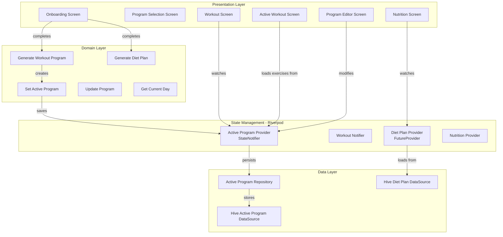
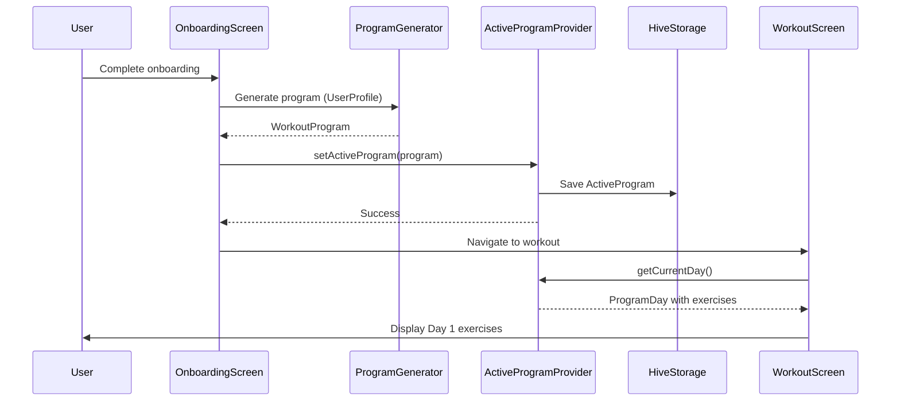
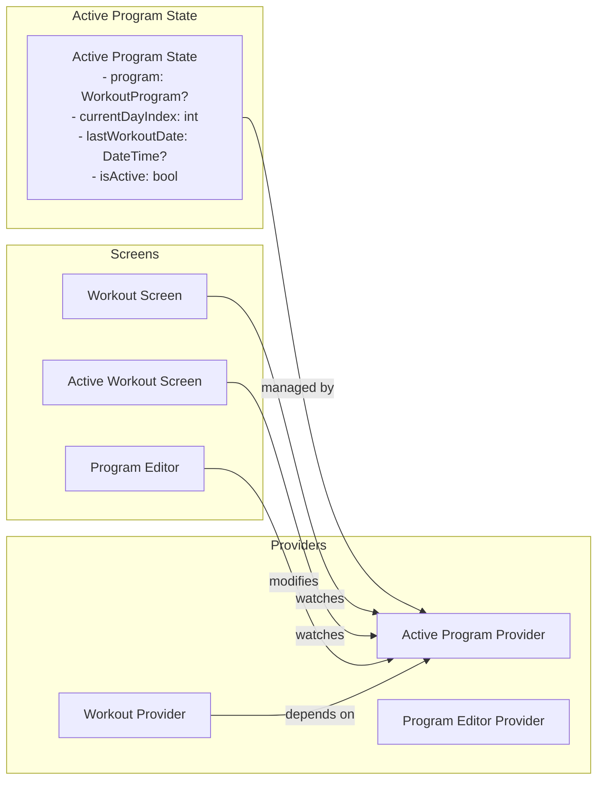

# Technical Design Document: Connect Existing Systems in IronFlow

## Overview

This design document specifies the technical architecture for integrating IronFlow's existing workout program generation and diet plan systems into the actual user workflow. Currently, the `GenerateWorkoutProgramUseCase` and `GenerateDietPlanUseCase` exist in isolation—they can create structured programs, but these programs are not connected to the workout session flow or nutrition tracking screens. This feature bridges that gap by introducing the Active Program concept as the single source of truth for workout sessions and connecting diet plans to the nutrition screen.

### Design Goals

1. **Single Source of Truth**: Active_Program becomes the authoritative source for workout exercises, replacing fallback exercises
2. **Seamless Onboarding Integration**: Users transition from onboarding → program generation → first workout without empty states
3. **Program Customization**: Users can edit, reorder, and replace exercises in their active program
4. **Video Player Fix**: Replace url_launcher with video_player package for proper autoplay and fullscreen support
5. **Diet Plan Integration**: Connect generated diet plans to nutrition screen with meal swapping and macro tracking
6. **State Management**: Centralized Active_Program_Provider using Riverpod for consistent state across screens
7. **Persistence**: Active program and diet plan persist across app restarts with progress tracking

### Key Architectural Changes

- **New Entity**: `ActiveProgram` entity wrapping `WorkoutProgram` with state (current_day_index, is_active, last_workout_date)
- **New Provider**: `ActiveProgramProvider` (StateNotifier) managing active program state
- **Modified Flow**: Workout_Session loads exercises from Active_Program_Provider instead of generic database
- **New Screen**: Program_Editor for customizing active programs
- **New Component**: Video_Player widget using video_player package
- **Modified Screen**: Nutrition_Screen displays diet plan targets and suggested meals
- **Navigation Updates**: go_router changes for program selection and editor screens

## Architecture

### High-Level Component Diagram



### Data Flow: Onboarding to First Workout



### State Management Architecture



## Components and Interfaces

### Domain Layer

#### New Entity: ActiveProgram

```dart
import 'package:freezed_annotation/freezed_annotation.dart';
import 'workout_program.dart';

part 'active_program.freezed.dart';

/// Represents the currently active workout program with state tracking.
/// This is the single source of truth for workout sessions.
@freezed
class ActiveProgram with _$ActiveProgram {
  const factory ActiveProgram({
    required String id,
    required WorkoutProgram program,
    required int currentDayIndex,  // 0-based index into program.days
    required bool isActive,
    DateTime? lastWorkoutDate,
    @Default({}) Map<int, DateTime> completedDays,  // dayIndex -> completionDate
  }) = _ActiveProgram;
  
  const ActiveProgram._();
  
  /// Get the current program day based on currentDayIndex
  ProgramDay get currentDay {
    if (currentDayIndex >= program.days.length) {
      return program.days.first;  // Wrap around to day 1
    }
    return program.days[currentDayIndex];
  }
  
  /// Check if the current day is a rest day
  bool get isRestDay => currentDay.isRestDay;
  
  /// Get the next workout day index (skipping rest days)
  int get nextWorkoutDayIndex {
    int nextIndex = (currentDayIndex + 1) % program.days.length;
    int attempts = 0;
    
    while (program.days[nextIndex].isRestDay && attempts < program.days.length) {
      nextIndex = (nextIndex + 1) % program.days.length;
      attempts++;
    }
    
    return nextIndex;
  }
  
  /// Calculate completion percentage for current week
  double get weekCompletionPercentage {
    final daysInWeek = 7;
    final completedThisWeek = completedDays.values
        .where((date) => DateTime.now().difference(date).inDays < 7)
        .length;
    return (completedThisWeek / daysInWeek).clamp(0.0, 1.0);
  }
  
  /// Mark current day as complete and advance to next day
  ActiveProgram completeCurrentDay() {
    final now = DateTime.now();
    final updatedCompletedDays = Map<int, DateTime>.from(completedDays);
    updatedCompletedDays[currentDayIndex] = now;
    
    return copyWith(
      currentDayIndex: nextWorkoutDayIndex,
      lastWorkoutDate: now,
      completedDays: updatedCompletedDays,
    );
  }
  
  /// Update the underlying workout program (for editing)
  ActiveProgram updateProgram(WorkoutProgram updatedProgram) {
    return copyWith(program: updatedProgram);
  }
}
```

#### New Entity: DietPlanState

```dart
import 'package:freezed_annotation/freezed_annotation.dart';
import '../entities/diet_plan.dart';

part 'diet_plan_state.freezed.dart';

/// Represents the active diet plan with customizations
@freezed
class DietPlanState with _$DietPlanState {
  const factory DietPlanState({
    required DietPlan plan,
    @Default({}) Map<String, DietMeal> mealSwaps,  // mealId -> swapped meal
    DateTime? lastUpdated,
  }) = _DietPlanState;
  
  const DietPlanState._();
  
  /// Get meals for a specific day with swaps applied
  List<DietMeal> getMealsForDay(String dayName) {
    final day = plan.days.firstWhere(
      (d) => d.dayName == dayName,
      orElse: () => plan.days.first,
    );
    
    return day.meals.map((meal) {
      final mealId = '${dayName}_${meal.mealType.name}';
      return mealSwaps[mealId] ?? meal;
    }).toList();
  }
  
  /// Swap a meal with an alternative
  DietPlanState swapMeal(String dayName, MealType mealType, DietMeal newMeal) {
    final mealId = '${dayName}_${mealType.name}';
    final updatedSwaps = Map<String, DietMeal>.from(mealSwaps);
    updatedSwaps[mealId] = newMeal;
    
    return copyWith(
      mealSwaps: updatedSwaps,
      lastUpdated: DateTime.now(),
    );
  }
}
```

#### Repository Interfaces

```dart
/// Repository for managing the active workout program
abstract class ActiveProgramRepository {
  /// Save the active program to local storage
  Future<void> saveActiveProgram(ActiveProgram program);
  
  /// Load the active program from local storage
  Future<ActiveProgram?> loadActiveProgram();
  
  /// Clear the active program (when user wants to start fresh)
  Future<void> clearActiveProgram();
  
  /// Update specific fields of the active program
  Future<void> updateActiveProgram(ActiveProgram program);
}

/// Repository for managing diet plans
abstract class DietPlanRepository {
  /// Save a diet plan to local storage
  Future<void> saveDietPlan(DietPlanState planState);
  
  /// Load the active diet plan from local storage
  Future<DietPlanState?> loadDietPlan();
  
  /// Clear the diet plan
  Future<void> clearDietPlan();
}
```

#### Use Cases

```dart
/// Set a workout program as the active program
class SetActiveProgramUseCase {
  final ActiveProgramRepository repository;
  
  SetActiveProgramUseCase(this.repository);
  
  Future<void> call(WorkoutProgram program) async {
    final activeProgram = ActiveProgram(
      id: const Uuid().v4(),
      program: program,
      currentDayIndex: 0,
      isActive: true,
      lastWorkoutDate: null,
      completedDays: {},
    );
    
    await repository.saveActiveProgram(activeProgram);
  }
}

/// Update the active program (for editing)
class UpdateActiveProgramUseCase {
  final ActiveProgramRepository repository;
  
  UpdateActiveProgramUseCase(this.repository);
  
  Future<void> call(ActiveProgram program) async {
    await repository.updateActiveProgram(program);
  }
}

/// Get the current program day
class GetCurrentDayUseCase {
  final ActiveProgramRepository repository;
  
  GetCurrentDayUseCase(this.repository);
  
  Future<ProgramDay?> call() async {
    final activeProgram = await repository.loadActiveProgram();
    return activeProgram?.currentDay;
  }
}

/// Complete the current workout day and advance
class CompleteWorkoutDayUseCase {
  final ActiveProgramRepository repository;
  
  CompleteWorkoutDayUseCase(this.repository);
  
  Future<void> call() async {
    final activeProgram = await repository.loadActiveProgram();
    if (activeProgram == null) return;
    
    final updated = activeProgram.completeCurrentDay();
    await repository.updateActiveProgram(updated);
  }
}

/// Clear the active program
class ClearActiveProgramUseCase {
  final ActiveProgramRepository repository;
  
  ClearActiveProgramUseCase(this.repository);
  
  Future<void> call() async {
    await repository.clearActiveProgram();
  }
}

/// Replace an exercise in the active program
class ReplaceExerciseUseCase {
  final ActiveProgramRepository repository;
  
  ReplaceExerciseUseCase(this.repository);
  
  Future<void> call({
    required int dayIndex,
    required int exerciseIndex,
    required String newExerciseName,
  }) async {
    final activeProgram = await repository.loadActiveProgram();
    if (activeProgram == null) return;
    
    final day = activeProgram.program.days[dayIndex];
    final updatedExercises = List<ProgramExercise>.from(day.exercises);
    final oldExercise = updatedExercises[exerciseIndex];
    
    // Preserve sets, reps, rest when replacing
    updatedExercises[exerciseIndex] = ProgramExercise(
      exerciseName: newExerciseName,
      sets: oldExercise.sets,
      reps: oldExercise.reps,
      restSeconds: oldExercise.restSeconds,
      notes: oldExercise.notes,
    );
    
    final updatedDay = ProgramDay(
      dayNumber: day.dayNumber,
      name: day.name,
      focus: day.focus,
      exercises: updatedExercises,
      isRestDay: day.isRestDay,
    );
    
    final updatedDays = List<ProgramDay>.from(activeProgram.program.days);
    updatedDays[dayIndex] = updatedDay;
    
    final updatedProgram = WorkoutProgram(
      id: activeProgram.program.id,
      name: activeProgram.program.name,
      description: activeProgram.program.description,
      days: updatedDays,
      durationWeeks: activeProgram.program.durationWeeks,
      difficulty: activeProgram.program.difficulty,
    );
    
    final updated = activeProgram.updateProgram(updatedProgram);
    await repository.updateActiveProgram(updated);
  }
}

/// Reorder exercises within a program day
class ReorderExercisesUseCase {
  final ActiveProgramRepository repository;
  
  ReorderExercisesUseCase(this.repository);
  
  Future<void> call({
    required int dayIndex,
    required int oldIndex,
    required int newIndex,
  }) async {
    final activeProgram = await repository.loadActiveProgram();
    if (activeProgram == null) return;
    
    final day = activeProgram.program.days[dayIndex];
    final updatedExercises = List<ProgramExercise>.from(day.exercises);
    
    final exercise = updatedExercises.removeAt(oldIndex);
    updatedExercises.insert(newIndex, exercise);
    
    final updatedDay = ProgramDay(
      dayNumber: day.dayNumber,
      name: day.name,
      focus: day.focus,
      exercises: updatedExercises,
      isRestDay: day.isRestDay,
    );
    
    final updatedDays = List<ProgramDay>.from(activeProgram.program.days);
    updatedDays[dayIndex] = updatedDay;
    
    final updatedProgram = WorkoutProgram(
      id: activeProgram.program.id,
      name: activeProgram.program.name,
      description: activeProgram.program.description,
      days: updatedDays,
      durationWeeks: activeProgram.program.durationWeeks,
      difficulty: activeProgram.program.difficulty,
    );
    
    final updated = activeProgram.updateProgram(updatedProgram);
    await repository.updateActiveProgram(updated);
  }
}

/// Update sets/reps for an exercise
class UpdateExerciseParametersUseCase {
  final ActiveProgramRepository repository;
  
  UpdateExerciseParametersUseCase(this.repository);
  
  Future<void> call({
    required int dayIndex,
    required int exerciseIndex,
    int? sets,
    String? reps,
    int? restSeconds,
  }) async {
    final activeProgram = await repository.loadActiveProgram();
    if (activeProgram == null) return;
    
    final day = activeProgram.program.days[dayIndex];
    final updatedExercises = List<ProgramExercise>.from(day.exercises);
    final oldExercise = updatedExercises[exerciseIndex];
    
    updatedExercises[exerciseIndex] = ProgramExercise(
      exerciseName: oldExercise.exerciseName,
      sets: sets ?? oldExercise.sets,
      reps: reps ?? oldExercise.reps,
      restSeconds: restSeconds ?? oldExercise.restSeconds,
      notes: oldExercise.notes,
    );
    
    final updatedDay = ProgramDay(
      dayNumber: day.dayNumber,
      name: day.name,
      focus: day.focus,
      exercises: updatedExercises,
      isRestDay: day.isRestDay,
    );
    
    final updatedDays = List<ProgramDay>.from(activeProgram.program.days);
    updatedDays[dayIndex] = updatedDay;
    
    final updatedProgram = WorkoutProgram(
      id: activeProgram.program.id,
      name: activeProgram.program.name,
      description: activeProgram.program.description,
      days: updatedDays,
      durationWeeks: activeProgram.program.durationWeeks,
      difficulty: activeProgram.program.difficulty,
    );
    
    final updated = activeProgram.updateProgram(updatedProgram);
    await repository.updateActiveProgram(updated);
  }
}

/// Save diet plan to storage
class SaveDietPlanUseCase {
  final DietPlanRepository repository;
  
  SaveDietPlanUseCase(this.repository);
  
  Future<void> call(DietPlan plan) async {
    final planState = DietPlanState(
      plan: plan,
      mealSwaps: {},
      lastUpdated: DateTime.now(),
    );
    await repository.saveDietPlan(planState);
  }
}

/// Swap a meal in the diet plan
class SwapDietMealUseCase {
  final DietPlanRepository repository;
  
  SwapDietMealUseCase(this.repository);
  
  Future<void> call({
    required String dayName,
    required MealType mealType,
    required DietMeal newMeal,
  }) async {
    final planState = await repository.loadDietPlan();
    if (planState == null) return;
    
    final updated = planState.swapMeal(dayName, mealType, newMeal);
    await repository.saveDietPlan(updated);
  }
}
```

## Data Models

### Data Layer Models

```dart
import 'package:freezed_annotation/freezed_annotation.dart';
import '../../domain/entities/active_program.dart';
import '../../domain/entities/workout_program.dart';

part 'active_program_model.freezed.dart';
part 'active_program_model.g.dart';

/// Data model for ActiveProgram with JSON serialization
@freezed
class ActiveProgramModel with _$ActiveProgramModel {
  const factory ActiveProgramModel({
    required String id,
    required WorkoutProgramModel program,
    required int currentDayIndex,
    required bool isActive,
    String? lastWorkoutDate,  // ISO 8601 string
    @Default({}) Map<String, String> completedDays,  // dayIndex as string -> ISO date
  }) = _ActiveProgramModel;
  
  factory ActiveProgramModel.fromJson(Map<String, dynamic> json) =>
      _$ActiveProgramModelFromJson(json);
  
  factory ActiveProgramModel.fromEntity(ActiveProgram entity) {
    return ActiveProgramModel(
      id: entity.id,
      program: WorkoutProgramModel.fromEntity(entity.program),
      currentDayIndex: entity.currentDayIndex,
      isActive: entity.isActive,
      lastWorkoutDate: entity.lastWorkoutDate?.toIso8601String(),
      completedDays: entity.completedDays.map(
        (key, value) => MapEntry(key.toString(), value.toIso8601String()),
      ),
    );
  }
  
  ActiveProgram toEntity() {
    return ActiveProgram(
      id: id,
      program: program.toEntity(),
      currentDayIndex: currentDayIndex,
      isActive: isActive,
      lastWorkoutDate: lastWorkoutDate != null 
          ? DateTime.parse(lastWorkoutDate!) 
          : null,
      completedDays: completedDays.map(
        (key, value) => MapEntry(int.parse(key), DateTime.parse(value)),
      ),
    );
  }
}

/// Data model for WorkoutProgram with JSON serialization
@freezed
class WorkoutProgramModel with _$WorkoutProgramModel {
  const factory WorkoutProgramModel({
    required String id,
    required String name,
    required String description,
    required List<ProgramDayModel> days,
    required int durationWeeks,
    required String difficulty,
  }) = _WorkoutProgramModel;
  
  factory WorkoutProgramModel.fromJson(Map<String, dynamic> json) =>
      _$WorkoutProgramModelFromJson(json);
  
  factory WorkoutProgramModel.fromEntity(WorkoutProgram entity) {
    return WorkoutProgramModel(
      id: entity.id,
      name: entity.name,
      description: entity.description,
      days: entity.days.map(ProgramDayModel.fromEntity).toList(),
      durationWeeks: entity.durationWeeks,
      difficulty: entity.difficulty,
    );
  }
  
  WorkoutProgram toEntity() {
    return WorkoutProgram(
      id: id,
      name: name,
      description: description,
      days: days.map((d) => d.toEntity()).toList(),
      durationWeeks: durationWeeks,
      difficulty: difficulty,
    );
  }
}

/// Data model for ProgramDay with JSON serialization
@freezed
class ProgramDayModel with _$ProgramDayModel {
  const factory ProgramDayModel({
    required int dayNumber,
    required String name,
    required String focus,
    required List<ProgramExerciseModel> exercises,
    @Default(false) bool isRestDay,
  }) = _ProgramDayModel;
  
  factory ProgramDayModel.fromJson(Map<String, dynamic> json) =>
      _$ProgramDayModelFromJson(json);
  
  factory ProgramDayModel.fromEntity(ProgramDay entity) {
    return ProgramDayModel(
      dayNumber: entity.dayNumber,
      name: entity.name,
      focus: entity.focus,
      exercises: entity.exercises.map(ProgramExerciseModel.fromEntity).toList(),
      isRestDay: entity.isRestDay,
    );
  }
  
  ProgramDay toEntity() {
    return ProgramDay(
      dayNumber: dayNumber,
      name: name,
      focus: focus,
      exercises: exercises.map((e) => e.toEntity()).toList(),
      isRestDay: isRestDay,
    );
  }
}

/// Data model for ProgramExercise with JSON serialization
@freezed
class ProgramExerciseModel with _$ProgramExerciseModel {
  const factory ProgramExerciseModel({
    required String exerciseName,
    required int sets,
    required String reps,
    required int restSeconds,
    String? notes,
  }) = _ProgramExerciseModel;
  
  factory ProgramExerciseModel.fromJson(Map<String, dynamic> json) =>
      _$ProgramExerciseModelFromJson(json);
  
  factory ProgramExerciseModel.fromEntity(ProgramExercise entity) {
    return ProgramExerciseModel(
      exerciseName: entity.exerciseName,
      sets: entity.sets,
      reps: entity.reps,
      restSeconds: entity.restSeconds,
      notes: entity.notes,
    );
  }
  
  ProgramExercise toEntity() {
    return ProgramExercise(
      exerciseName: exerciseName,
      sets: sets,
      reps: reps,
      restSeconds: restSeconds,
      notes: notes,
    );
  }
}

/// Data model for DietPlanState with JSON serialization
@freezed
class DietPlanStateModel with _$DietPlanStateModel {
  const factory DietPlanStateModel({
    required DietPlanModel plan,
    @Default({}) Map<String, DietMealModel> mealSwaps,
    String? lastUpdated,
  }) = _DietPlanStateModel;
  
  factory DietPlanStateModel.fromJson(Map<String, dynamic> json) =>
      _$DietPlanStateModelFromJson(json);
  
  factory DietPlanStateModel.fromEntity(DietPlanState entity) {
    return DietPlanStateModel(
      plan: DietPlanModel.fromEntity(entity.plan),
      mealSwaps: entity.mealSwaps.map(
        (key, value) => MapEntry(key, DietMealModel.fromEntity(value)),
      ),
      lastUpdated: entity.lastUpdated?.toIso8601String(),
    );
  }
  
  DietPlanState toEntity() {
    return DietPlanState(
      plan: plan.toEntity(),
      mealSwaps: mealSwaps.map(
        (key, value) => MapEntry(key, value.toEntity()),
      ),
      lastUpdated: lastUpdated != null ? DateTime.parse(lastUpdated!) : null,
    );
  }
}

// Note: DietPlanModel, DietDayModel, DietMealModel would follow similar patterns
// but are omitted for brevity as they mirror the existing DietPlan structure
```

### Local Storage Implementation

```dart
import 'package:hive/hive.dart';
import '../models/active_program_model.dart';
import '../models/diet_plan_state_model.dart';

/// Hive data source for active program storage
class HiveActiveProgramDataSource {
  static const String boxName = 'active_program';
  static const String key = 'current_active_program';
  
  Future<Box<Map>> get _box async => await Hive.openBox<Map>(boxName);
  
  Future<void> saveActiveProgram(ActiveProgramModel program) async {
    final box = await _box;
    await box.put(key, program.toJson());
  }
  
  Future<ActiveProgramModel?> loadActiveProgram() async {
    final box = await _box;
    final json = box.get(key);
    if (json == null) return null;
    
    return ActiveProgramModel.fromJson(Map<String, dynamic>.from(json));
  }
  
  Future<void> clearActiveProgram() async {
    final box = await _box;
    await box.delete(key);
  }
}

/// Hive data source for diet plan storage
class HiveDietPlanDataSource {
  static const String boxName = 'diet_plan';
  static const String key = 'current_diet_plan';
  
  Future<Box<Map>> get _box async => await Hive.openBox<Map>(boxName);
  
  Future<void> saveDietPlan(DietPlanStateModel planState) async {
    final box = await _box;
    await box.put(key, planState.toJson());
  }
  
  Future<DietPlanStateModel?> loadDietPlan() async {
    final box = await _box;
    final json = box.get(key);
    if (json == null) return null;
    
    return DietPlanStateModel.fromJson(Map<String, dynamic>.from(json));
  }
  
  Future<void> clearDietPlan() async {
    final box = await _box;
    await box.delete(key);
  }
}

/// Repository implementation for active program
class ActiveProgramRepositoryImpl implements ActiveProgramRepository {
  final HiveActiveProgramDataSource dataSource;
  
  ActiveProgramRepositoryImpl(this.dataSource);
  
  @override
  Future<void> saveActiveProgram(ActiveProgram program) async {
    final model = ActiveProgramModel.fromEntity(program);
    await dataSource.saveActiveProgram(model);
  }
  
  @override
  Future<ActiveProgram?> loadActiveProgram() async {
    final model = await dataSource.loadActiveProgram();
    return model?.toEntity();
  }
  
  @override
  Future<void> clearActiveProgram() async {
    await dataSource.clearActiveProgram();
  }
  
  @override
  Future<void> updateActiveProgram(ActiveProgram program) async {
    await saveActiveProgram(program);
  }
}

/// Repository implementation for diet plan
class DietPlanRepositoryImpl implements DietPlanRepository {
  final HiveDietPlanDataSource dataSource;
  
  DietPlanRepositoryImpl(this.dataSource);
  
  @override
  Future<void> saveDietPlan(DietPlanState planState) async {
    final model = DietPlanStateModel.fromEntity(planState);
    await dataSource.saveDietPlan(model);
  }
  
  @override
  Future<DietPlanState?> loadDietPlan() async {
    final model = await dataSource.loadDietPlan();
    return model?.toEntity();
  }
  
  @override
  Future<void> clearDietPlan() async {
    await dataSource.clearDietPlan();
  }
}
```


### State Management - Riverpod Providers

```dart
import 'package:flutter_riverpod/flutter_riverpod.dart';
import '../../domain/entities/active_program.dart';
import '../../domain/usecases/usecases.dart';

// Repository Providers
final activeProgramRepositoryProvider = Provider<ActiveProgramRepository>((ref) {
  final dataSource = HiveActiveProgramDataSource();
  return ActiveProgramRepositoryImpl(dataSource);
});

final dietPlanRepositoryProvider = Provider<DietPlanRepository>((ref) {
  final dataSource = HiveDietPlanDataSource();
  return DietPlanRepositoryImpl(dataSource);
});

// Use Case Providers
final setActiveProgramUseCaseProvider = Provider<SetActiveProgramUseCase>((ref) {
  final repository = ref.watch(activeProgramRepositoryProvider);
  return SetActiveProgramUseCase(repository);
});

final updateActiveProgramUseCaseProvider = Provider<UpdateActiveProgramUseCase>((ref) {
  final repository = ref.watch(activeProgramRepositoryProvider);
  return UpdateActiveProgramUseCase(repository);
});

final getCurrentDayUseCaseProvider = Provider<GetCurrentDayUseCase>((ref) {
  final repository = ref.watch(activeProgramRepositoryProvider);
  return GetCurrentDayUseCase(repository);
});

final completeWorkoutDayUseCaseProvider = Provider<CompleteWorkoutDayUseCase>((ref) {
  final repository = ref.watch(activeProgramRepositoryProvider);
  return CompleteWorkoutDayUseCase(repository);
});

final replaceExerciseUseCaseProvider = Provider<ReplaceExerciseUseCase>((ref) {
  final repository = ref.watch(activeProgramRepositoryProvider);
  return ReplaceExerciseUseCase(repository);
});

final reorderExercisesUseCaseProvider = Provider<ReorderExercisesUseCase>((ref) {
  final repository = ref.watch(activeProgramRepositoryProvider);
  return ReorderExercisesUseCase(repository);
});

final updateExerciseParametersUseCaseProvider = Provider<UpdateExerciseParametersUseCase>((ref) {
  final repository = ref.watch(activeProgramRepositoryProvider);
  return UpdateExerciseParametersUseCase(repository);
});

final saveDietPlanUseCaseProvider = Provider<SaveDietPlanUseCase>((ref) {
  final repository = ref.watch(dietPlanRepositoryProvider);
  return SaveDietPlanUseCase(repository);
});

final swapDietMealUseCaseProvider = Provider<SwapDietMealUseCase>((ref) {
  final repository = ref.watch(dietPlanRepositoryProvider);
  return SwapDietMealUseCase(repository);
});

// Active Program State Notifier
class ActiveProgramNotifier extends StateNotifier<AsyncValue<ActiveProgram?>> {
  final ActiveProgramRepository _repository;
  final UpdateActiveProgramUseCase _updateUseCase;
  
  ActiveProgramNotifier(this._repository, this._updateUseCase) 
      : super(const AsyncValue.loading()) {
    _loadActiveProgram();
  }
  
  Future<void> _loadActiveProgram() async {
    state = const AsyncValue.loading();
    try {
      final program = await _repository.loadActiveProgram();
      state = AsyncValue.data(program);
    } catch (error, stackTrace) {
      state = AsyncValue.error(error, stackTrace);
    }
  }
  
  Future<void> setActiveProgram(WorkoutProgram program) async {
    final activeProgram = ActiveProgram(
      id: const Uuid().v4(),
      program: program,
      currentDayIndex: 0,
      isActive: true,
      lastWorkoutDate: null,
      completedDays: {},
    );
    
    await _repository.saveActiveProgram(activeProgram);
    state = AsyncValue.data(activeProgram);
  }
  
  Future<void> updateProgram(ActiveProgram program) async {
    await _updateUseCase(program);
    state = AsyncValue.data(program);
  }
  
  Future<void> clearProgram() async {
    await _repository.clearActiveProgram();
    state = const AsyncValue.data(null);
  }
  
  ProgramDay? getCurrentDay() {
    return state.value?.currentDay;
  }
  
  Future<void> completeCurrentDay() async {
    final current = state.value;
    if (current == null) return;
    
    final updated = current.completeCurrentDay();
    await updateProgram(updated);
  }
  
  Future<void> setCurrentDayIndex(int index) async {
    final current = state.value;
    if (current == null) return;
    
    final updated = current.copyWith(currentDayIndex: index);
    await updateProgram(updated);
  }
  
  void refresh() {
    _loadActiveProgram();
  }
}

final activeProgramProvider = StateNotifierProvider<ActiveProgramNotifier, AsyncValue<ActiveProgram?>>(
  (ref) {
    final repository = ref.watch(activeProgramRepositoryProvider);
    final updateUseCase = ref.watch(updateActiveProgramUseCaseProvider);
    return ActiveProgramNotifier(repository, updateUseCase);
  },
);

// Diet Plan State Provider
final dietPlanProvider = FutureProvider<DietPlanState?>((ref) async {
  final repository = ref.watch(dietPlanRepositoryProvider);
  return await repository.loadDietPlan();
});

// Helper provider to get current day exercises
final currentDayExercisesProvider = Provider<List<ProgramExercise>>((ref) {
  final activeProgramAsync = ref.watch(activeProgramProvider);
  
  return activeProgramAsync.when(
    data: (program) => program?.currentDay.exercises ?? [],
    loading: () => [],
    error: (_, __) => [],
  );
});

// Helper provider to check if there's an active program
final hasActiveProgramProvider = Provider<bool>((ref) {
  final activeProgramAsync = ref.watch(activeProgramProvider);
  
  return activeProgramAsync.when(
    data: (program) => program != null && program.isActive,
    loading: () => false,
    error: (_, __) => false,
  );
});
```

### UI Components

#### Video Player Widget

```dart
import 'package:flutter/material.dart';
import 'package:video_player/video_player.dart';

/// Video player widget for exercise demonstrations
/// Uses video_player package for autoplay and fullscreen support
class ExerciseVideoPlayer extends StatefulWidget {
  final String videoUrl;
  final String? fallbackImageUrl;
  
  const ExerciseVideoPlayer({
    required this.videoUrl,
    this.fallbackImageUrl,
    super.key,
  });
  
  @override
  State<ExerciseVideoPlayer> createState() => _ExerciseVideoPlayerState();
}

class _ExerciseVideoPlayerState extends State<ExerciseVideoPlayer> {
  VideoPlayerController? _controller;
  bool _isLoading = true;
  bool _hasError = false;
  bool _isMuted = true;
  bool _isFullscreen = false;
  int _retryCount = 0;
  
  @override
  void initState() {
    super.initState();
    _initializeVideo();
  }
  
  Future<void> _initializeVideo() async {
    setState(() {
      _isLoading = true;
      _hasError = false;
    });
    
    try {
      _controller = VideoPlayerController.networkUrl(Uri.parse(widget.videoUrl));
      await _controller!.initialize();
      
      // Autoplay muted
      _controller!.setVolume(0);
      _controller!.setLooping(true);
      _controller!.play();
      
      setState(() {
        _isLoading = false;
      });
    } catch (error) {
      debugPrint('Video loading error: $error');
      
      // Retry once after 2 seconds
      if (_retryCount < 1) {
        _retryCount++;
        await Future.delayed(const Duration(seconds: 2));
        _initializeVideo();
      } else {
        setState(() {
          _isLoading = false;
          _hasError = true;
        });
      }
    }
  }
  
  void _toggleMute() {
    if (_controller == null) return;
    
    setState(() {
      _isMuted = !_isMuted;
      _controller!.setVolume(_isMuted ? 0 : 1.0);
    });
  }
  
  void _toggleFullscreen() {
    setState(() {
      _isFullscreen = !_isFullscreen;
    });
    
    if (_isFullscreen) {
      Navigator.of(context).push(
        MaterialPageRoute(
          fullscreenDialog: true,
          builder: (context) => Scaffold(
            backgroundColor: Colors.black,
            body: Center(
              child: GestureDetector(
                onTap: () => Navigator.of(context).pop(),
                child: AspectRatio(
                  aspectRatio: _controller!.value.aspectRatio,
                  child: VideoPlayer(_controller!),
                ),
              ),
            ),
          ),
        ),
      ).then((_) {
        setState(() {
          _isFullscreen = false;
        });
      });
    }
  }
  
  @override
  void dispose() {
    _controller?.dispose();
    super.dispose();
  }
  
  @override
  Widget build(BuildContext context) {
    if (_isLoading) {
      return Container(
        height: 200,
        color: Colors.grey[900],
        child: const Center(
          child: CircularProgressIndicator(),
        ),
      );
    }
    
    if (_hasError) {
      return Container(
        height: 200,
        color: Colors.grey[900],
        child: Column(
          mainAxisAlignment: MainAxisAlignment.center,
          children: [
            if (widget.fallbackImageUrl != null)
              Image.network(
                widget.fallbackImageUrl!,
                height: 150,
                fit: BoxFit.cover,
                errorBuilder: (_, __, ___) => const Icon(
                  Icons.fitness_center,
                  size: 64,
                  color: Colors.grey,
                ),
              )
            else
              const Icon(
                Icons.fitness_center,
                size: 64,
                color: Colors.grey,
              ),
            const SizedBox(height: 8),
            const Text(
              'Video unavailable',
              style: TextStyle(color: Colors.grey),
            ),
          ],
        ),
      );
    }
    
    return GestureDetector(
      onTap: _toggleFullscreen,
      child: Stack(
        alignment: Alignment.center,
        children: [
          AspectRatio(
            aspectRatio: _controller!.value.aspectRatio,
            child: VideoPlayer(_controller!),
          ),
          Positioned(
            bottom: 8,
            right: 8,
            child: IconButton(
              icon: Icon(
                _isMuted ? Icons.volume_off : Icons.volume_up,
                color: Colors.white,
              ),
              onPressed: _toggleMute,
            ),
          ),
          Positioned(
            bottom: 8,
            left: 8,
            child: Icon(
              Icons.fullscreen,
              color: Colors.white.withOpacity(0.7),
            ),
          ),
        ],
      ),
    );
  }
}
```

#### Program Editor Screen

```dart
import 'package:flutter/material.dart';
import 'package:flutter_riverpod/flutter_riverpod.dart';

/// Screen for editing the active workout program
class ProgramEditorScreen extends ConsumerStatefulWidget {
  const ProgramEditorScreen({super.key});
  
  @override
  ConsumerState<ProgramEditorScreen> createState() => _ProgramEditorScreenState();
}

class _ProgramEditorScreenState extends ConsumerState<ProgramEditorScreen> {
  int _selectedDayIndex = 0;
  
  @override
  Widget build(BuildContext context) {
    final activeProgramAsync = ref.watch(activeProgramProvider);
    
    return Scaffold(
      appBar: AppBar(
        title: const Text('Edit Program'),
        actions: [
          IconButton(
            icon: const Icon(Icons.check),
            onPressed: () => Navigator.of(context).pop(),
          ),
        ],
      ),
      body: activeProgramAsync.when(
        data: (activeProgram) {
          if (activeProgram == null) {
            return const Center(
              child: Text('No active program'),
            );
          }
          
          final program = activeProgram.program;
          final selectedDay = program.days[_selectedDayIndex];
          
          return Column(
            children: [
              // Day selector
              SizedBox(
                height: 60,
                child: ListView.builder(
                  scrollDirection: Axis.horizontal,
                  itemCount: program.days.length,
                  itemBuilder: (context, index) {
                    final day = program.days[index];
                    final isSelected = index == _selectedDayIndex;
                    
                    return Padding(
                      padding: const EdgeInsets.all(8.0),
                      child: ChoiceChip(
                        label: Text(day.name),
                        selected: isSelected,
                        onSelected: (_) {
                          setState(() {
                            _selectedDayIndex = index;
                          });
                        },
                      ),
                    );
                  },
                ),
              ),
              
              // Exercise list with drag-drop
              Expanded(
                child: selectedDay.isRestDay
                    ? const Center(child: Text('Rest Day'))
                    : ReorderableListView.builder(
                        itemCount: selectedDay.exercises.length,
                        onReorder: (oldIndex, newIndex) {
                          _reorderExercises(oldIndex, newIndex);
                        },
                        itemBuilder: (context, index) {
                          final exercise = selectedDay.exercises[index];
                          
                          return ExerciseEditCard(
                            key: ValueKey('${_selectedDayIndex}_$index'),
                            exercise: exercise,
                            dayIndex: _selectedDayIndex,
                            exerciseIndex: index,
                          );
                        },
                      ),
              ),
            ],
          );
        },
        loading: () => const Center(child: CircularProgressIndicator()),
        error: (error, _) => Center(child: Text('Error: $error')),
      ),
    );
  }
  
  Future<void> _reorderExercises(int oldIndex, int newIndex) async {
    if (newIndex > oldIndex) {
      newIndex -= 1;
    }
    
    final reorderUseCase = ref.read(reorderExercisesUseCaseProvider);
    await reorderUseCase(
      dayIndex: _selectedDayIndex,
      oldIndex: oldIndex,
      newIndex: newIndex,
    );
    
    ref.read(activeProgramProvider.notifier).refresh();
  }
}

/// Card for editing a single exercise
class ExerciseEditCard extends ConsumerWidget {
  final ProgramExercise exercise;
  final int dayIndex;
  final int exerciseIndex;
  
  const ExerciseEditCard({
    required this.exercise,
    required this.dayIndex,
    required this.exerciseIndex,
    super.key,
  });
  
  @override
  Widget build(BuildContext context, WidgetRef ref) {
    return Card(
      margin: const EdgeInsets.symmetric(horizontal: 16, vertical: 8),
      child: ListTile(
        leading: const Icon(Icons.drag_handle),
        title: Text(exercise.exerciseName),
        subtitle: Text('${exercise.sets} sets × ${exercise.reps} reps'),
        trailing: PopupMenuButton<String>(
          onSelected: (value) {
            switch (value) {
              case 'replace':
                _showReplaceDialog(context, ref);
                break;
              case 'edit':
                _showEditDialog(context, ref);
                break;
              case 'delete':
                // TODO: Implement delete
                break;
            }
          },
          itemBuilder: (context) => [
            const PopupMenuItem(
              value: 'replace',
              child: Text('Replace Exercise'),
            ),
            const PopupMenuItem(
              value: 'edit',
              child: Text('Edit Sets/Reps'),
            ),
            const PopupMenuItem(
              value: 'delete',
              child: Text('Delete'),
            ),
          ],
        ),
      ),
    );
  }
  
  Future<void> _showReplaceDialog(BuildContext context, WidgetRef ref) async {
    // TODO: Show exercise picker filtered by muscle group
    // For now, show a simple text input
    final controller = TextEditingController();
    
    final result = await showDialog<String>(
      context: context,
      builder: (context) => AlertDialog(
        title: const Text('Replace Exercise'),
        content: TextField(
          controller: controller,
          decoration: const InputDecoration(
            labelText: 'New Exercise Name',
          ),
        ),
        actions: [
          TextButton(
            onPressed: () => Navigator.of(context).pop(),
            child: const Text('Cancel'),
          ),
          TextButton(
            onPressed: () => Navigator.of(context).pop(controller.text),
            child: const Text('Replace'),
          ),
        ],
      ),
    );
    
    if (result != null && result.isNotEmpty) {
      final replaceUseCase = ref.read(replaceExerciseUseCaseProvider);
      await replaceUseCase(
        dayIndex: dayIndex,
        exerciseIndex: exerciseIndex,
        newExerciseName: result,
      );
      ref.read(activeProgramProvider.notifier).refresh();
    }
  }
  
  Future<void> _showEditDialog(BuildContext context, WidgetRef ref) async {
    final setsController = TextEditingController(text: exercise.sets.toString());
    final repsController = TextEditingController(text: exercise.reps);
    final restController = TextEditingController(text: exercise.restSeconds.toString());
    
    final result = await showDialog<bool>(
      context: context,
      builder: (context) => AlertDialog(
        title: const Text('Edit Parameters'),
        content: Column(
          mainAxisSize: MainAxisSize.min,
          children: [
            TextField(
              controller: setsController,
              decoration: const InputDecoration(labelText: 'Sets'),
              keyboardType: TextInputType.number,
            ),
            TextField(
              controller: repsController,
              decoration: const InputDecoration(labelText: 'Reps'),
            ),
            TextField(
              controller: restController,
              decoration: const InputDecoration(labelText: 'Rest (seconds)'),
              keyboardType: TextInputType.number,
            ),
          ],
        ),
        actions: [
          TextButton(
            onPressed: () => Navigator.of(context).pop(false),
            child: const Text('Cancel'),
          ),
          TextButton(
            onPressed: () => Navigator.of(context).pop(true),
            child: const Text('Save'),
          ),
        ],
      ),
    );
    
    if (result == true) {
      final updateUseCase = ref.read(updateExerciseParametersUseCaseProvider);
      await updateUseCase(
        dayIndex: dayIndex,
        exerciseIndex: exerciseIndex,
        sets: int.tryParse(setsController.text),
        reps: repsController.text,
        restSeconds: int.tryParse(restController.text),
      );
      ref.read(activeProgramProvider.notifier).refresh();
    }
  }
}
```

#### Modified Workout Screen

```dart
import 'package:flutter/material.dart';
import 'package:flutter_riverpod/flutter_riverpod.dart';

/// Main workout screen showing active program
class WorkoutScreen extends ConsumerWidget {
  const WorkoutScreen({super.key});
  
  @override
  Widget build(BuildContext context, WidgetRef ref) {
    final activeProgramAsync = ref.watch(activeProgramProvider);
    
    return Scaffold(
      appBar: AppBar(
        title: const Text('Workout'),
        actions: [
          IconButton(
            icon: const Icon(Icons.edit),
            onPressed: () {
              Navigator.of(context).pushNamed('/workout/editor');
            },
          ),
        ],
      ),
      body: activeProgramAsync.when(
        data: (activeProgram) {
          if (activeProgram == null || !activeProgram.isActive) {
            return _buildEmptyState(context);
          }
          
          return _buildActiveProgramView(context, ref, activeProgram);
        },
        loading: () => const Center(child: CircularProgressIndicator()),
        error: (error, _) => Center(child: Text('Error: $error')),
      ),
    );
  }
  
  Widget _buildEmptyState(BuildContext context) {
    return Center(
      child: Column(
        mainAxisAlignment: MainAxisAlignment.center,
        children: [
          const Icon(Icons.fitness_center, size: 64, color: Colors.grey),
          const SizedBox(height: 16),
          const Text(
            'No Active Program',
            style: TextStyle(fontSize: 20, fontWeight: FontWeight.bold),
          ),
          const SizedBox(height: 8),
          const Text(
            'Generate a program to get started',
            style: TextStyle(color: Colors.grey),
          ),
          const SizedBox(height: 24),
          ElevatedButton(
            onPressed: () {
              Navigator.of(context).pushNamed('/workout/program-selection');
            },
            child: const Text('Generate Program'),
          ),
        ],
      ),
    );
  }
  
  Widget _buildActiveProgramView(
    BuildContext context,
    WidgetRef ref,
    ActiveProgram activeProgram,
  ) {
    final currentDay = activeProgram.currentDay;
    
    return Column(
      children: [
        // Program header
        Container(
          padding: const EdgeInsets.all(16),
          color: Theme.of(context).colorScheme.primaryContainer,
          child: Column(
            crossAxisAlignment: CrossAxisAlignment.start,
            children: [
              Text(
                activeProgram.program.name,
                style: Theme.of(context).textTheme.headlineSmall,
              ),
              const SizedBox(height: 4),
              Text(
                activeProgram.program.description,
                style: Theme.of(context).textTheme.bodyMedium,
              ),
              const SizedBox(height: 8),
              LinearProgressIndicator(
                value: activeProgram.weekCompletionPercentage,
              ),
              const SizedBox(height: 4),
              Text(
                '${(activeProgram.weekCompletionPercentage * 100).toInt()}% complete this week',
                style: Theme.of(context).textTheme.bodySmall,
              ),
            ],
          ),
        ),
        
        // Week view
        SizedBox(
          height: 80,
          child: ListView.builder(
            scrollDirection: Axis.horizontal,
            itemCount: activeProgram.program.days.length,
            itemBuilder: (context, index) {
              final day = activeProgram.program.days[index];
              final isCurrentDay = index == activeProgram.currentDayIndex;
              final isCompleted = activeProgram.completedDays.containsKey(index);
              
              return GestureDetector(
                onTap: () {
                  ref.read(activeProgramProvider.notifier).setCurrentDayIndex(index);
                },
                child: Container(
                  width: 60,
                  margin: const EdgeInsets.all(8),
                  decoration: BoxDecoration(
                    color: isCurrentDay
                        ? Theme.of(context).colorScheme.primary
                        : Colors.grey[800],
                    borderRadius: BorderRadius.circular(8),
                  ),
                  child: Column(
                    mainAxisAlignment: MainAxisAlignment.center,
                    children: [
                      Text(
                        'Day ${day.dayNumber}',
                        style: TextStyle(
                          color: isCurrentDay ? Colors.white : Colors.grey,
                          fontSize: 12,
                        ),
                      ),
                      if (isCompleted)
                        const Icon(Icons.check_circle, color: Colors.green, size: 20),
                      if (day.isRestDay)
                        const Icon(Icons.hotel, color: Colors.grey, size: 20),
                    ],
                  ),
                ),
              );
            },
          ),
        ),
        
        // Current day content
        Expanded(
          child: currentDay.isRestDay
              ? const Center(
                  child: Column(
                    mainAxisAlignment: MainAxisAlignment.center,
                    children: [
                      Icon(Icons.hotel, size: 64, color: Colors.grey),
                      SizedBox(height: 16),
                      Text(
                        'Rest Day',
                        style: TextStyle(fontSize: 24, fontWeight: FontWeight.bold),
                      ),
                      SizedBox(height: 8),
                      Text(
                        'Recovery is essential for progress',
                        style: TextStyle(color: Colors.grey),
                      ),
                    ],
                  ),
                )
              : Column(
                  crossAxisAlignment: CrossAxisAlignment.start,
                  children: [
                    Padding(
                      padding: const EdgeInsets.all(16),
                      child: Column(
                        crossAxisAlignment: CrossAxisAlignment.start,
                        children: [
                          Text(
                            currentDay.name,
                            style: Theme.of(context).textTheme.titleLarge,
                          ),
                          Text(
                            'Focus: ${currentDay.focus}',
                            style: Theme.of(context).textTheme.bodyMedium?.copyWith(
                              color: Colors.grey,
                            ),
                          ),
                        ],
                      ),
                    ),
                    Expanded(
                      child: ListView.builder(
                        itemCount: currentDay.exercises.length,
                        itemBuilder: (context, index) {
                          final exercise = currentDay.exercises[index];
                          return ProgramExerciseCard(exercise: exercise);
                        },
                      ),
                    ),
                    Padding(
                      padding: const EdgeInsets.all(16),
                      child: SizedBox(
                        width: double.infinity,
                        child: ElevatedButton(
                          onPressed: currentDay.isRestDay
                              ? null
                              : () {
                                  Navigator.of(context).pushNamed('/workout/active');
                                },
                          child: const Text('Start Workout'),
                        ),
                      ),
                    ),
                  ],
                ),
        ),
      ],
    );
  }
}

/// Card displaying a program exercise
class ProgramExerciseCard extends StatelessWidget {
  final ProgramExercise exercise;
  
  const ProgramExerciseCard({
    required this.exercise,
    super.key,
  });
  
  @override
  Widget build(BuildContext context) {
    return Card(
      margin: const EdgeInsets.symmetric(horizontal: 16, vertical: 8),
      child: Padding(
        padding: const EdgeInsets.all(16),
        child: Column(
          crossAxisAlignment: CrossAxisAlignment.start,
          children: [
            Text(
              exercise.exerciseName,
              style: Theme.of(context).textTheme.titleMedium,
            ),
            const SizedBox(height: 8),
            Row(
              children: [
                _buildInfoChip(
                  context,
                  Icons.fitness_center,
                  '${exercise.sets} sets',
                ),
                const SizedBox(width: 8),
                _buildInfoChip(
                  context,
                  Icons.repeat,
                  '${exercise.reps} reps',
                ),
                const SizedBox(width: 8),
                _buildInfoChip(
                  context,
                  Icons.timer,
                  '${exercise.restSeconds}s rest',
                ),
              ],
            ),
            if (exercise.notes != null) ...[
              const SizedBox(height: 8),
              Text(
                exercise.notes!,
                style: Theme.of(context).textTheme.bodySmall?.copyWith(
                  color: Colors.grey,
                  fontStyle: FontStyle.italic,
                ),
              ),
            ],
          ],
        ),
      ),
    );
  }
  
  Widget _buildInfoChip(BuildContext context, IconData icon, String label) {
    return Container(
      padding: const EdgeInsets.symmetric(horizontal: 8, vertical: 4),
      decoration: BoxDecoration(
        color: Theme.of(context).colorScheme.surfaceVariant,
        borderRadius: BorderRadius.circular(12),
      ),
      child: Row(
        mainAxisSize: MainAxisSize.min,
        children: [
          Icon(icon, size: 16),
          const SizedBox(width: 4),
          Text(label, style: const TextStyle(fontSize: 12)),
        ],
      ),
    );
  }
}
```


#### Modified Nutrition Screen

```dart
import 'package:flutter/material.dart';
import 'package:flutter_riverpod/flutter_riverpod.dart';

/// Nutrition screen displaying diet plan and daily tracking
class NutritionScreen extends ConsumerWidget {
  const NutritionScreen({super.key});
  
  @override
  Widget build(BuildContext context, WidgetRef ref) {
    final dietPlanAsync = ref.watch(dietPlanProvider);
    final today = DateTime.now();
    final dailySummaryAsync = ref.watch(
      dailyNutritionSummaryProvider(today),
    );
    
    return Scaffold(
      appBar: AppBar(
        title: const Text('Nutrition'),
      ),
      body: Column(
        children: [
          // Diet plan targets
          dietPlanAsync.when(
            data: (planState) {
              if (planState == null) {
                return _buildDefaultTargets(context);
              }
              return _buildDietPlanTargets(context, planState);
            },
            loading: () => const LinearProgressIndicator(),
            error: (_, __) => _buildDefaultTargets(context),
          ),
          
          // Daily summary and macro wheel
          Expanded(
            child: dailySummaryAsync.when(
              data: (summary) => _buildDailySummary(context, ref, summary),
              loading: () => const Center(child: CircularProgressIndicator()),
              error: (error, _) => Center(child: Text('Error: $error')),
            ),
          ),
        ],
      ),
      floatingActionButton: FloatingActionButton(
        onPressed: () {
          Navigator.of(context).pushNamed('/nutrition/log-meal');
        },
        child: const Icon(Icons.add),
      ),
    );
  }
  
  Widget _buildDefaultTargets(BuildContext context) {
    return Container(
      padding: const EdgeInsets.all(16),
      color: Theme.of(context).colorScheme.surfaceVariant,
      child: Column(
        crossAxisAlignment: CrossAxisAlignment.start,
        children: [
          Text(
            'Daily Targets',
            style: Theme.of(context).textTheme.titleMedium,
          ),
          const SizedBox(height: 8),
          Row(
            mainAxisAlignment: MainAxisAlignment.spaceAround,
            children: [
              _buildMacroTarget('Calories', '2000', 'kcal'),
              _buildMacroTarget('Protein', '150', 'g'),
              _buildMacroTarget('Carbs', '200', 'g'),
              _buildMacroTarget('Fats', '60', 'g'),
            ],
          ),
          const SizedBox(height: 8),
          TextButton(
            onPressed: () {
              // Navigate to program generation
            },
            child: const Text('Generate Diet Plan'),
          ),
        ],
      ),
    );
  }
  
  Widget _buildDietPlanTargets(BuildContext context, DietPlanState planState) {
    final plan = planState.plan;
    
    return Container(
      padding: const EdgeInsets.all(16),
      color: Theme.of(context).colorScheme.primaryContainer,
      child: Column(
        crossAxisAlignment: CrossAxisAlignment.start,
        children: [
          Row(
            mainAxisAlignment: MainAxisAlignment.spaceBetween,
            children: [
              Text(
                plan.name,
                style: Theme.of(context).textTheme.titleMedium,
              ),
              IconButton(
                icon: const Icon(Icons.edit),
                onPressed: () {
                  // Navigate to diet plan editor
                },
              ),
            ],
          ),
          const SizedBox(height: 8),
          Row(
            mainAxisAlignment: MainAxisAlignment.spaceAround,
            children: [
              _buildMacroTarget('Calories', plan.dailyCalories.toInt().toString(), 'kcal'),
              _buildMacroTarget('Protein', plan.proteinG.toInt().toString(), 'g'),
              _buildMacroTarget('Carbs', plan.carbsG.toInt().toString(), 'g'),
              _buildMacroTarget('Fats', plan.fatsG.toInt().toString(), 'g'),
            ],
          ),
        ],
      ),
    );
  }
  
  Widget _buildMacroTarget(String label, String value, String unit) {
    return Column(
      children: [
        Text(
          label,
          style: const TextStyle(fontSize: 12, color: Colors.grey),
        ),
        const SizedBox(height: 4),
        RichText(
          text: TextSpan(
            children: [
              TextSpan(
                text: value,
                style: const TextStyle(
                  fontSize: 20,
                  fontWeight: FontWeight.bold,
                ),
              ),
              TextSpan(
                text: ' $unit',
                style: const TextStyle(fontSize: 12, color: Colors.grey),
              ),
            ],
          ),
        ),
      ],
    );
  }
  
  Widget _buildDailySummary(
    BuildContext context,
    WidgetRef ref,
    DailyNutritionSummary summary,
  ) {
    return SingleChildScrollView(
      child: Column(
        children: [
          const SizedBox(height: 16),
          
          // Macro wheel chart
          SizedBox(
            height: 200,
            child: MacroWheelChart(
              protein: summary.totalProtein,
              carbs: summary.totalCarbs,
              fats: summary.totalFats,
            ),
          ),
          
          const SizedBox(height: 16),
          
          // Remaining macros
          Padding(
            padding: const EdgeInsets.symmetric(horizontal: 16),
            child: Card(
              child: Padding(
                padding: const EdgeInsets.all(16),
                child: Column(
                  crossAxisAlignment: CrossAxisAlignment.start,
                  children: [
                    Text(
                      'Remaining',
                      style: Theme.of(context).textTheme.titleMedium,
                    ),
                    const SizedBox(height: 8),
                    _buildRemainingMacro(
                      'Protein',
                      summary.remaining.protein,
                      summary.target.protein,
                    ),
                    _buildRemainingMacro(
                      'Carbs',
                      summary.remaining.carbs,
                      summary.target.carbs,
                    ),
                    _buildRemainingMacro(
                      'Fats',
                      summary.remaining.fats,
                      summary.target.fats,
                    ),
                  ],
                ),
              ),
            ),
          ),
          
          const SizedBox(height: 16),
          
          // Logged meals
          Padding(
            padding: const EdgeInsets.symmetric(horizontal: 16),
            child: Column(
              crossAxisAlignment: CrossAxisAlignment.start,
              children: [
                Text(
                  'Today\'s Meals',
                  style: Theme.of(context).textTheme.titleMedium,
                ),
                const SizedBox(height: 8),
                ...summary.meals.map((meal) => MealCard(meal: meal)),
              ],
            ),
          ),
        ],
      ),
    );
  }
  
  Widget _buildRemainingMacro(String label, double remaining, double target) {
    final percentage = (remaining / target).clamp(0.0, 1.0);
    final isOver = remaining < 0;
    
    return Padding(
      padding: const EdgeInsets.symmetric(vertical: 4),
      child: Row(
        children: [
          SizedBox(
            width: 80,
            child: Text(label),
          ),
          Expanded(
            child: LinearProgressIndicator(
              value: isOver ? 1.0 : 1.0 - percentage,
              backgroundColor: Colors.grey[800],
              color: isOver ? Colors.red : Colors.green,
            ),
          ),
          const SizedBox(width: 8),
          SizedBox(
            width: 60,
            child: Text(
              '${remaining.toInt()}g',
              textAlign: TextAlign.right,
              style: TextStyle(
                color: isOver ? Colors.red : null,
              ),
            ),
          ),
        ],
      ),
    );
  }
}

/// Card displaying a logged meal
class MealCard extends StatelessWidget {
  final Meal meal;
  
  const MealCard({required this.meal, super.key});
  
  @override
  Widget build(BuildContext context) {
    return Card(
      margin: const EdgeInsets.only(bottom: 8),
      child: ListTile(
        title: Text(meal.name),
        subtitle: Text(
          'P: ${meal.protein.toInt()}g | C: ${meal.carbs.toInt()}g | F: ${meal.fats.toInt()}g',
        ),
        trailing: Text(
          '${meal.calories.toInt()} kcal',
          style: Theme.of(context).textTheme.titleMedium,
        ),
      ),
    );
  }
}
```

### Navigation Updates

```dart
import 'package:go_router/go_router.dart';
import 'package:flutter_riverpod/flutter_riverpod.dart';

final routerProvider = Provider<GoRouter>((ref) {
  return GoRouter(
    initialLocation: '/home',
    routes: [
      GoRoute(
        path: '/home',
        builder: (context, state) => const HomeScreen(),
      ),
      GoRoute(
        path: '/onboarding',
        builder: (context, state) => const OnboardingScreen(),
      ),
      GoRoute(
        path: '/workout',
        builder: (context, state) => const WorkoutScreen(),
        routes: [
          GoRoute(
            path: 'active',
            builder: (context, state) => const ActiveWorkoutScreen(),
          ),
          GoRoute(
            path: 'history',
            builder: (context, state) => const WorkoutHistoryScreen(),
          ),
          GoRoute(
            path: 'editor',
            builder: (context, state) => const ProgramEditorScreen(),
          ),
          GoRoute(
            path: 'program-selection',
            builder: (context, state) => const ProgramSelectionScreen(),
          ),
          GoRoute(
            path: 'exercise/:name',
            builder: (context, state) {
              final name = state.pathParameters['name']!;
              return ExerciseDetailScreen(exerciseName: name);
            },
          ),
        ],
      ),
      GoRoute(
        path: '/progress',
        builder: (context, state) => const ProgressScreen(),
      ),
      GoRoute(
        path: '/nutrition',
        builder: (context, state) => const NutritionScreen(),
        routes: [
          GoRoute(
            path: 'log-meal',
            builder: (context, state) => const FoodSearchScreen(),
          ),
        ],
      ),
      GoRoute(
        path: '/profile',
        builder: (context, state) => const ProfileScreen(),
      ),
    ],
  );
});
```

### Onboarding Integration Flow

```dart
import 'package:flutter/material.dart';
import 'package:flutter_riverpod/flutter_riverpod.dart';

/// Modified onboarding screen with program generation integration
class OnboardingScreen extends ConsumerStatefulWidget {
  const OnboardingScreen({super.key});
  
  @override
  ConsumerState<OnboardingScreen> createState() => _OnboardingScreenState();
}

class _OnboardingScreenState extends ConsumerState<OnboardingScreen> {
  // ... existing onboarding state ...
  
  Future<void> _completeOnboarding() async {
    // Save user profile
    final profile = _buildUserProfile();
    await ref.read(userProfileStorageProvider).saveProfile(profile);
    
    // Show loading dialog
    if (!mounted) return;
    showDialog(
      context: context,
      barrierDismissible: false,
      builder: (context) => const Center(
        child: Card(
          child: Padding(
            padding: EdgeInsets.all(24),
            child: Column(
              mainAxisSize: MainAxisSize.min,
              children: [
                CircularProgressIndicator(),
                SizedBox(height: 16),
                Text('Generating your personalized program...'),
              ],
            ),
          ),
        ),
      ),
    );
    
    try {
      // Generate workout program
      final workoutProgram = ref.read(generateWorkoutProgramUseCaseProvider)(profile);
      await ref.read(activeProgramProvider.notifier).setActiveProgram(workoutProgram);
      
      // Generate diet plan
      final dietPlan = ref.read(generateDietPlanUseCaseProvider)(profile);
      await ref.read(saveDietPlanUseCaseProvider)(dietPlan);
      
      // Close loading dialog
      if (!mounted) return;
      Navigator.of(context).pop();
      
      // Navigate to workout screen
      context.go('/workout');
    } catch (error) {
      // Handle error
      if (!mounted) return;
      Navigator.of(context).pop();
      
      ScaffoldMessenger.of(context).showSnackBar(
        SnackBar(content: Text('Error: $error')),
      );
    }
  }
  
  UserProfile _buildUserProfile() {
    // ... build profile from onboarding state ...
    return UserProfile(
      goal: _selectedGoal,
      age: _age,
      weightKg: _weight,
      heightCm: _height,
      fitnessLevel: _fitnessLevel,
      equipment: _equipment,
      workoutDaysPerWeek: _workoutDays,
      budget: _budget,
    );
  }
  
  @override
  Widget build(BuildContext context) {
    // ... existing onboarding UI ...
    // Final step button calls _completeOnboarding()
    return Container(); // Placeholder
  }
}
```

## Error Handling

### Exception Classes

```dart
/// Exception thrown when active program operations fail
class ActiveProgramException implements Exception {
  final String message;
  
  ActiveProgramException(this.message);
  
  @override
  String toString() => 'ActiveProgramException: $message';
}

/// Exception thrown when program validation fails
class ProgramValidationException implements Exception {
  final String message;
  
  ProgramValidationException(this.message);
  
  @override
  String toString() => 'ProgramValidationException: $message';
}

/// Exception thrown when diet plan operations fail
class DietPlanException implements Exception {
  final String message;
  
  DietPlanException(this.message);
  
  @override
  String toString() => 'DietPlanException: $message';
}
```

### Error Handling Strategy

1. **Repository Layer**: Catch storage exceptions and wrap in domain exceptions
2. **Use Case Layer**: Validate inputs and throw validation exceptions
3. **Presentation Layer**: Display user-friendly error messages via SnackBar
4. **State Management**: Use AsyncValue.error to propagate errors to UI

### Validation Rules

```dart
/// Validator for program exercise parameters
class ProgramExerciseValidator {
  static void validate({
    required int sets,
    required String reps,
    required int restSeconds,
  }) {
    if (sets <= 0) {
      throw ProgramValidationException('Sets must be positive');
    }
    
    if (restSeconds < 0) {
      throw ProgramValidationException('Rest seconds cannot be negative');
    }
    
    // Validate reps format (e.g., "8-12" or "15")
    if (!_isValidRepsFormat(reps)) {
      throw ProgramValidationException('Invalid reps format');
    }
  }
  
  static bool _isValidRepsFormat(String reps) {
    // Single number
    if (int.tryParse(reps) != null) return true;
    
    // Range format (e.g., "8-12")
    final parts = reps.split('-');
    if (parts.length == 2) {
      final start = int.tryParse(parts[0]);
      final end = int.tryParse(parts[1]);
      return start != null && end != null && start < end;
    }
    
    return false;
  }
}
```

## Testing Strategy

### Testing Approach Assessment

This feature primarily involves:
- **UI Integration**: Connecting screens and navigation flows
- **State Management**: Riverpod providers managing active program state
- **Data Persistence**: Hive storage for active programs and diet plans
- **Business Logic**: Use cases for program manipulation (replace, reorder, update)

**Property-Based Testing Applicability**: **LIMITED**

While some components have testable properties, the majority of this feature involves:
- UI rendering and navigation (not suitable for PBT)
- State management integration (better tested with integration tests)
- Storage operations (better tested with integration tests)
- Configuration and setup (smoke tests)

**PBT IS appropriate for**:
- Serialization round-trips (ActiveProgram ↔ JSON)
- Program manipulation logic (reorder, replace preserving structure)
- Validation logic (exercise parameters)

**PBT is NOT appropriate for**:
- UI components (video player, program editor, nutrition screen)
- Navigation flows (onboarding → program generation → workout)
- Riverpod provider behavior (state updates, notifications)
- Hive storage operations (infrastructure)

### Testing Strategy

#### Unit Tests (Example-Based)
- Exercise parameter validation (positive sets, valid reps format, non-negative rest)
- Program day navigation (next workout day skipping rest days)
- Week completion percentage calculation
- Meal swap logic
- Error handling for invalid inputs

#### Integration Tests
- Onboarding → Program Generation → Active Program Save → Workout Screen navigation
- Program Editor: Replace exercise → Save → Verify in Active Workout Screen
- Nutrition Screen: Log meal → Macro wheel updates within 200ms
- Video Player: Load → Autoplay muted → Tap to fullscreen → Tap to exit
- Active Program persistence across app restarts

#### Widget Tests
- WorkoutScreen displays empty state when no active program
- WorkoutScreen displays program info when active program exists
- ProgramEditorScreen allows drag-drop reordering
- NutritionScreen displays diet plan targets
- ExerciseVideoPlayer shows fallback on error

#### Property-Based Tests (Limited Scope)
Only for pure logic components:

1. **Serialization Round-Trip**: For any ActiveProgram, serializing then deserializing produces equivalent entity
2. **Exercise Reordering Preserves Count**: For any program day and valid indices, reordering preserves exercise count
3. **Replace Exercise Preserves Parameters**: For any exercise replacement, sets/reps/rest are preserved

### Test Coverage Goals
- Unit tests: 80%+ coverage of use cases and validators
- Integration tests: Cover all critical user flows
- Widget tests: Cover all major screens
- Property tests: Cover serialization and pure logic


## Correctness Properties

### Property-Based Testing Applicability

After analyzing all 20 requirements with 120 acceptance criteria, **property-based testing is applicable to a LIMITED subset** of this feature. The majority of requirements involve UI integration, navigation flows, and state management which are better tested with example-based and integration tests.

**PBT-Applicable Requirements** (identified from prework):
- 2.3: Program generation matching split type
- 3.6: Exercise reordering preserving structure
- 3.8: Exercise parameter validation
- 6.6: Meal quantity macro scaling
- 6.7, 15.2: Meal alternative macro similarity
- 8.2: Program exercise transformation
- 8.6: Workout day advancement logic
- 11.2: Exercise picker muscle group filtering
- 11.4: Exercise replacement parameter preservation
- 16.1, 16.2, 16.3: Input validation
- 19.4: Week completion percentage calculation

### Property Reflection

Reviewing the identified properties for redundancy:

1. **Validation Properties (16.1, 16.2, 16.3)**: These can be combined into a single comprehensive validation property
2. **Meal Macro Properties (6.6, 6.7, 15.2)**: 6.7 and 15.2 are the same (alternative meal macro similarity), can be combined
3. **Exercise Transformation (8.2) and Replacement (11.4)**: Both test data preservation, but in different contexts - keep separate
4. **Program Generation (2.3)**: Unique property about structure matching
5. **Reordering (3.6)**: Unique property about list manipulation
6. **Day Advancement (8.6)**: Unique property about state progression
7. **Filtering (11.2)**: Unique property about search/filter logic
8. **Completion Calculation (19.4)**: Unique property about percentage math

**Final Property Count**: 9 properties (after combining validation and meal macro properties)

*A property is a characteristic or behavior that should hold true across all valid executions of a system—essentially, a formal statement about what the system should do. Properties serve as the bridge between human-readable specifications and machine-verifiable correctness guarantees.*

### Property 1: Program Generation Structure Matching

*For any* valid UserProfile and selected SplitType, the generated WorkoutProgram SHALL have a day count matching the split structure (Full Body = 3 workout days, Upper-Lower = 4 workout days, Push-Pull-Legs = 6 workout days) and each workout day SHALL contain exercises appropriate to the split focus.

**Validates: Requirements 2.3**

**Test Strategy**: Generate random user profiles with varying goals, fitness levels, and equipment. For each split type, verify the generated program has the correct number of workout days (excluding rest days) and that day names/focus match the split pattern.

### Property 2: Exercise Reordering Preservation

*For any* ProgramDay with N exercises and any valid old_index and new_index (0 ≤ old_index, new_index < N), reordering an exercise SHALL preserve the total exercise count and all exercise data, only changing the position of the moved exercise.

**Validates: Requirements 3.6**

**Test Strategy**: Generate random program days with varying exercise counts. Perform reordering with random valid indices. Verify: (1) exercise count unchanged, (2) all exercises still present, (3) moved exercise is at new position, (4) other exercises maintain relative order.

### Property 3: Exercise Parameter Validation

*For any* input values for sets, reps, and restSeconds:
- Sets validation SHALL accept positive integers and reject zero, negative, or non-integer values
- Reps validation SHALL accept positive integers or valid range format "X-Y" where X < Y, and reject invalid formats
- RestSeconds validation SHALL accept non-negative integers and reject negative or non-integer values

**Validates: Requirements 3.8, 16.1, 16.2, 16.3**

**Test Strategy**: Generate random valid inputs (positive integers, valid ranges) and invalid inputs (negative, zero, non-integer, malformed ranges). Verify validation accepts all valid inputs and rejects all invalid inputs with appropriate error messages.

### Property 4: Meal Quantity Macro Scaling

*For any* DietMeal and any positive quantity multiplier Q, adjusting the meal quantity SHALL scale calories, protein, carbs, and fats proportionally by Q (scaled_value = original_value × Q).

**Validates: Requirements 6.6**

**Test Strategy**: Generate random meals with varying macro values. Apply random positive quantity multipliers (0.5, 1.5, 2.0, etc.). Verify all macro values scale proportionally and maintain the same ratio to each other.

### Property 5: Meal Alternative Macro Similarity

*For any* DietMeal, alternative meal suggestions SHALL have macro profiles (protein, carbs, fats) within 10% tolerance of the original meal's macros.

**Validates: Requirements 6.7, 15.2**

**Test Strategy**: Generate random meals with varying macro profiles. Get alternative suggestions. For each alternative, verify: |alternative.protein - original.protein| ≤ 0.1 × original.protein (and same for carbs and fats).

### Property 6: Program Exercise Transformation

*For any* ProgramDay, transforming ProgramExercises to Exercise entities SHALL preserve all exercise data: exercise name, sets, reps, and rest seconds SHALL be identical in the transformed entities.

**Validates: Requirements 8.2**

**Test Strategy**: Generate random program days with varying exercises. Transform to Exercise entities. Verify each transformed exercise has the same name, sets, reps, and rest seconds as the source ProgramExercise.

### Property 7: Workout Day Advancement

*For any* ActiveProgram, completing the current workout day SHALL advance current_day_index to the next non-rest day, wrapping to day 0 if the end of the program is reached, and SHALL record the completion date.

**Validates: Requirements 8.6**

**Test Strategy**: Generate random active programs with varying day structures (including rest days). Complete current day. Verify: (1) current_day_index advances to next workout day (skipping rest days), (2) wraps to 0 if at end, (3) completion date is recorded, (4) completed day is marked in completedDays map.

### Property 8: Exercise Picker Muscle Group Filtering

*For any* exercise with a defined muscle group, the exercise picker SHALL return only exercises that target the same primary muscle group.

**Validates: Requirements 11.2**

**Test Strategy**: Generate random exercises with various muscle groups (chest, back, legs, shoulders, arms). For each exercise, get filtered picker results. Verify all returned exercises have the same muscle group as the original.

### Property 9: Exercise Replacement Parameter Preservation

*For any* ProgramExercise being replaced with a new exercise name, the replacement SHALL preserve the original sets, reps, and restSeconds values exactly.

**Validates: Requirements 11.4**

**Test Strategy**: Generate random program exercises with varying parameters. Replace with random new exercise names. Verify the replaced exercise has the new name but identical sets, reps, and restSeconds as the original.

### Property 10: Week Completion Percentage Calculation

*For any* ActiveProgram with completedDays map, the week completion percentage SHALL equal (number of days completed in last 7 days) / 7, clamped to [0.0, 1.0].

**Validates: Requirements 19.4**

**Test Strategy**: Generate random active programs with varying completion states (0 to 7+ completed days in various time ranges). Calculate percentage. Verify: (1) only days completed within last 7 days are counted, (2) result is divided by 7, (3) result is clamped to [0.0, 1.0].

## Error Handling

### Error Scenarios and Handling

1. **Active Program Not Found**
   - Scenario: User tries to start workout but no active program exists
   - Handling: Display empty state with "Generate Program" button
   - User Impact: Clear guidance to create a program

2. **Program Validation Failure**
   - Scenario: User enters invalid sets/reps/rest in program editor
   - Handling: Display inline error message, prevent save, highlight invalid field
   - User Impact: Immediate feedback, cannot save invalid data

3. **Video Loading Failure**
   - Scenario: Exercise video fails to load
   - Handling: Display fallback image with "Video unavailable" message, retry once after 2s
   - User Impact: Workout continues unblocked, visual fallback provided

4. **Storage Failure**
   - Scenario: Hive storage operation fails
   - Handling: Catch exception, display SnackBar with error message, log error
   - User Impact: Notified of issue, can retry operation

5. **Diet Plan Not Found**
   - Scenario: User opens nutrition screen but no diet plan exists
   - Handling: Display default macro targets with "Generate Diet Plan" button
   - User Impact: Can still track nutrition with defaults

6. **Meal Swap No Alternatives**
   - Scenario: User tries to swap meal but no alternatives match criteria
   - Handling: Display message "No alternatives available", keep original meal
   - User Impact: Informed of limitation, can manually adjust meal

### Error Recovery Strategies

- **Graceful Degradation**: Features continue working with reduced functionality (e.g., default targets when no diet plan)
- **Retry Logic**: Video player retries once on failure
- **User Guidance**: Empty states provide clear next actions
- **Data Validation**: Prevent invalid data from being saved
- **Error Logging**: All errors logged to console for debugging

## Testing Strategy

### Test Distribution

Given the analysis from the prework phase:

- **Property-Based Tests**: 10 tests (covering pure logic and data transformations)
- **Unit Tests**: ~40 tests (covering use cases, validators, state logic)
- **Integration Tests**: ~25 tests (covering workflows, storage, navigation)
- **Widget Tests**: ~30 tests (covering UI components and screens)

**Total**: ~105 tests

### Property-Based Test Configuration

- **Library**: Use `fast_check` (Dart port) or `test` package with custom generators
- **Iterations**: Minimum 100 iterations per property test
- **Generators**: Custom arbitraries for UserProfile, ProgramDay, ProgramExercise, DietMeal, ActiveProgram
- **Shrinking**: Enable shrinking to find minimal failing examples
- **Tagging**: Each property test tagged with `Feature: connect-existing-systems, Property N: [property text]`

### Unit Test Coverage

**Use Cases** (80%+ coverage):
- SetActiveProgramUseCase
- UpdateActiveProgramUseCase
- CompleteWorkoutDayUseCase
- ReplaceExerciseUseCase
- ReorderExercisesUseCase
- UpdateExerciseParametersUseCase
- SaveDietPlanUseCase
- SwapDietMealUseCase

**Validators**:
- ProgramExerciseValidator (sets, reps, rest validation)

**Domain Logic**:
- ActiveProgram.completeCurrentDay()
- ActiveProgram.nextWorkoutDayIndex
- ActiveProgram.weekCompletionPercentage
- DietPlanState.getMealsForDay()
- DietPlanState.swapMeal()

### Integration Test Scenarios

1. **Onboarding to First Workout Flow**
   - Complete onboarding → Generate program → Save active program → Navigate to workout screen → Verify first day displayed

2. **Program Editor Workflow**
   - Open editor → Replace exercise → Reorder exercises → Update sets/reps → Save → Verify changes in workout screen

3. **Workout Session with Active Program**
   - Start workout → Load exercises from active program → Log sets → Complete workout → Verify day advancement

4. **Diet Plan Integration**
   - Generate diet plan → Open nutrition screen → Verify targets displayed → Log meal → Verify macro wheel updates within 200ms

5. **Video Player Lifecycle**
   - Load video → Verify autoplay muted → Tap to fullscreen → Tap to exit → Verify inline mode

6. **Active Program Persistence**
   - Set active program → Close app → Reopen app → Verify active program loaded

7. **Meal Swap Workflow**
   - Open nutrition screen → Tap meal → Select swap → Choose alternative → Verify meal replaced and macros recalculated

### Widget Test Coverage

**Screens**:
- WorkoutScreen (empty state, active program display, week view, day selection)
- ProgramEditorScreen (day selector, exercise list, drag-drop, edit dialogs)
- NutritionScreen (diet plan targets, macro wheel, meal cards, remaining macros)
- ExerciseVideoPlayer (loading, playing, error fallback, fullscreen)

**Components**:
- ProgramExerciseCard (exercise info display)
- ExerciseEditCard (edit menu, replace dialog, edit dialog)
- MealCard (meal info display)
- MacroWheelChart (macro distribution visualization)

### Performance Testing

- **Macro Wheel Update**: Verify updates complete within 200ms of meal changes
- **Provider Notification**: Verify state changes notify widgets within 100ms
- **Video Autoplay**: Verify video starts playing within 500ms of load

### Test Execution Strategy

1. **Development**: Run unit tests on every save (fast feedback)
2. **Pre-commit**: Run unit + property tests (comprehensive logic validation)
3. **CI Pipeline**: Run all tests including integration and widget tests
4. **Property Tests**: Run with 100 iterations in CI, 20 iterations locally for speed

### Test Data Generators

```dart
/// Generator for UserProfile with random valid values
UserProfile generateUserProfile() {
  final random = Random();
  return UserProfile(
    goal: FitnessGoal.values[random.nextInt(FitnessGoal.values.length)],
    age: 18 + random.nextInt(50),
    weightKg: 50 + random.nextDouble() * 100,
    heightCm: 150 + random.nextDouble() * 50,
    fitnessLevel: FitnessLevel.values[random.nextInt(FitnessLevel.values.length)],
    equipment: EquipmentType.values[random.nextInt(EquipmentType.values.length)],
    workoutDaysPerWeek: 2 + random.nextInt(5),
    budget: BudgetLevel.values[random.nextInt(BudgetLevel.values.length)],
  );
}

/// Generator for ProgramDay with random exercises
ProgramDay generateProgramDay({int exerciseCount = 5}) {
  final random = Random();
  final exercises = List.generate(
    exerciseCount,
    (i) => ProgramExercise(
      exerciseName: 'Exercise ${i + 1}',
      sets: 2 + random.nextInt(4),
      reps: '${8 + random.nextInt(5)}-${12 + random.nextInt(5)}',
      restSeconds: 30 + random.nextInt(90),
    ),
  );
  
  return ProgramDay(
    dayNumber: 1,
    name: 'Test Day',
    focus: 'Full Body',
    exercises: exercises,
    isRestDay: false,
  );
}

/// Generator for DietMeal with random macros
DietMeal generateDietMeal() {
  final random = Random();
  final protein = 10 + random.nextDouble() * 40;
  final carbs = 20 + random.nextDouble() * 60;
  final fats = 5 + random.nextDouble() * 25;
  final calories = (protein * 4) + (carbs * 4) + (fats * 9);
  
  return DietMeal(
    mealType: MealType.values[random.nextInt(MealType.values.length)],
    name: 'Test Meal',
    ingredients: ['Ingredient 1', 'Ingredient 2'],
    calories: calories,
    proteinG: protein,
    carbsG: carbs,
    fatsG: fats,
  );
}

/// Generator for ActiveProgram with random state
ActiveProgram generateActiveProgram({int dayCount = 7}) {
  final random = Random();
  final days = List.generate(
    dayCount,
    (i) => i % 7 == 6 
        ? ProgramDay(dayNumber: i + 1, name: 'Rest', focus: 'Recovery', exercises: [], isRestDay: true)
        : generateProgramDay(),
  );
  
  final program = WorkoutProgram(
    id: 'test-program',
    name: 'Test Program',
    description: 'Test Description',
    days: days,
    durationWeeks: 4,
    difficulty: 'Intermediate',
  );
  
  return ActiveProgram(
    id: 'test-active',
    program: program,
    currentDayIndex: random.nextInt(dayCount),
    isActive: true,
    lastWorkoutDate: DateTime.now().subtract(Duration(days: random.nextInt(7))),
    completedDays: {},
  );
}
```

### Acceptance Criteria Coverage

All 120 acceptance criteria are covered by the test strategy:
- **10 criteria** → Property-based tests (universal properties)
- **70 criteria** → Example-based unit/widget tests (specific behaviors)
- **25 criteria** → Integration tests (workflows and persistence)
- **15 criteria** → Smoke tests (structural requirements and configuration)

### Success Metrics

- **Code Coverage**: 80%+ for domain and data layers
- **Test Execution Time**: < 2 minutes for full suite
- **Property Test Iterations**: 100 per test
- **Zero Flaky Tests**: All tests deterministic and reliable
- **CI Pass Rate**: 95%+ on main branch

