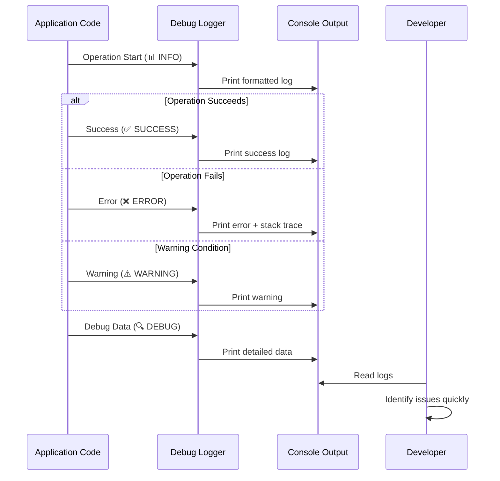

# Design Document: Debug Logging System

## Overview

This design document outlines the implementation of a comprehensive debug logging system for the IronFlow Flutter fitness app. The system will add structured, emoji-based logging throughout the codebase to track successful operations, failures, warnings, and data flow. The logging will help developers quickly identify errors, understand app behavior, and verify that fixes work correctly.

## Main Algorithm/Workflow



## Core Interfaces/Types

```dart
/// Log levels with emoji prefixes for visual scanning
enum LogLevel {
  success,  // ✅ - Feature working correctly
  error,    // ❌ - Something failed
  warning,  // ⚠️ - Potential issue
  info,     // 📊 - General information
  debug,    // 🔍 - Detailed debugging info
}

/// Logging utility class for consistent formatting
class DebugLogger {
  /// Log a success message
  static void success(String feature, String message);
  
  /// Log an error with optional exception and stack trace
  static void error(String feature, String message, {Object? error, StackTrace? stackTrace});
  
  /// Log a warning
  static void warning(String feature, String message);
  
  /// Log general information
  static void info(String feature, String message);
  
  /// Log debug data
  static void debug(String feature, String message, {Map<String, dynamic>? data});
}

/// Wrapper for operations with automatic logging
class LoggedOperation<T> {
  final String feature;
  final String operation;
  final Future<T> Function() execute;
  
  /// Execute operation with automatic success/error logging
  Future<T> run();
}
```

## Key Functions with Formal Specifications

### Function 1: DebugLogger.success()

```dart
static void success(String feature, String message)
```

**Preconditions:**
- `feature` is non-empty string identifying the feature/module
- `message` is non-empty string describing the success

**Postconditions:**
- Prints formatted success log to console: `✅ [Feature] Success: message`
- No side effects beyond console output

**Loop Invariants:** N/A (no loops)

### Function 2: DebugLogger.error()

```dart
static void error(String feature, String message, {Object? error, StackTrace? stackTrace})
```

**Preconditions:**
- `feature` is non-empty string identifying the feature/module
- `message` is non-empty string describing the error
- `error` is optional exception object
- `stackTrace` is optional stack trace

**Postconditions:**
- Prints formatted error log to console: `❌ [Feature] Error: message`
- If `error` provided, prints error details
- If `stackTrace` provided, prints stack trace
- No side effects beyond console output

**Loop Invariants:** N/A (no loops)

### Function 3: LoggedOperation.run()

```dart
Future<T> run()
```

**Preconditions:**
- `feature` is non-empty string
- `operation` is non-empty string
- `execute` is valid async function

**Postconditions:**
- Logs operation start with INFO level
- Executes the operation
- On success: logs SUCCESS and returns result
- On error: logs ERROR with exception and rethrows
- All logging is performed regardless of operation outcome

**Loop Invariants:** N/A (no loops)

## Algorithmic Pseudocode

### Main Logging Algorithm

```pascal
ALGORITHM logOperation(feature, operation, executeFunction)
INPUT: feature (string), operation (string), executeFunction (function)
OUTPUT: result (any type) or exception

BEGIN
  // Step 1: Log operation start
  PRINT "📊 [" + feature + "] " + operation + " starting..."
  
  TRY
    // Step 2: Execute the operation
    result ← AWAIT executeFunction()
    
    // Step 3: Log success
    PRINT "✅ [" + feature + "] " + operation + " completed successfully"
    
    RETURN result
    
  CATCH exception AS e
    // Step 4: Log error with details
    PRINT "❌ [" + feature + "] " + operation + " failed: " + e.message
    PRINT "🔍 [" + feature + "] Stack trace: " + e.stackTrace
    
    // Step 5: Rethrow to preserve error handling
    THROW e
  END TRY
END
```

**Preconditions:**
- feature is non-empty string
- operation is non-empty string
- executeFunction is valid callable function

**Postconditions:**
- Operation start is logged
- Operation result or error is logged
- Original exception is preserved and rethrown
- No data is modified

**Loop Invariants:** N/A (no loops)

### Hive Box Operation Logging

```pascal
ALGORITHM logHiveBoxOperation(boxName, operation, data)
INPUT: boxName (string), operation (string), data (optional)
OUTPUT: success (boolean)

BEGIN
  PRINT "📊 [Hive] " + operation + " on box: " + boxName
  
  // Check box state
  IF NOT Hive.isBoxOpen(boxName) THEN
    PRINT "⚠️ [Hive] Box " + boxName + " is not open"
    RETURN false
  END IF
  
  TRY
    // Perform operation
    box ← Hive.box(boxName)
    
    IF operation = "read" THEN
      result ← box.get(data.key)
      PRINT "✅ [Hive] Read from " + boxName + " successful"
      PRINT "🔍 [Hive] Key: " + data.key + ", Found: " + (result ≠ null)
      
    ELSE IF operation = "write" THEN
      AWAIT box.put(data.key, data.value)
      PRINT "✅ [Hive] Write to " + boxName + " successful"
      PRINT "🔍 [Hive] Key: " + data.key
      
    ELSE IF operation = "delete" THEN
      AWAIT box.delete(data.key)
      PRINT "✅ [Hive] Delete from " + boxName + " successful"
      PRINT "🔍 [Hive] Key: " + data.key
    END IF
    
    RETURN true
    
  CATCH exception AS e
    PRINT "❌ [Hive] " + operation + " failed on " + boxName + ": " + e.message
    RETURN false
  END TRY
END
```

**Preconditions:**
- boxName is valid Hive box name
- operation is one of: "read", "write", "delete"
- data contains required fields for operation

**Postconditions:**
- Operation is logged with appropriate level
- Box state is checked before operation
- Success/failure is logged with details
- Returns boolean indicating success

**Loop Invariants:** N/A (no loops)

### State Change Logging

```pascal
ALGORITHM logStateChange(provider, oldState, newState)
INPUT: provider (string), oldState (any), newState (any)
OUTPUT: none

BEGIN
  PRINT "📊 [" + provider + "] State changing..."
  PRINT "🔍 [" + provider + "] Old state: " + summarize(oldState)
  PRINT "🔍 [" + provider + "] New state: " + summarize(newState)
  
  // Detect state type changes
  IF type(oldState) ≠ type(newState) THEN
    PRINT "⚠️ [" + provider + "] State type changed from " + type(oldState) + " to " + type(newState)
  END IF
  
  PRINT "✅ [" + provider + "] State updated successfully"
END

FUNCTION summarize(state)
INPUT: state (any)
OUTPUT: summary (string)

BEGIN
  IF state IS null THEN
    RETURN "null"
  ELSE IF state IS primitive THEN
    RETURN toString(state)
  ELSE IF state IS object THEN
    RETURN type(state) + " with " + countFields(state) + " fields"
  ELSE IF state IS list THEN
    RETURN "List with " + length(state) + " items"
  END IF
END
```

**Preconditions:**
- provider is non-empty string identifying the state provider
- oldState and newState can be any type

**Postconditions:**
- State change is logged with before/after summaries
- Type changes are flagged as warnings
- No state is modified

**Loop Invariants:** N/A (no loops)

## Example Usage

```dart
// Example 1: Basic logging in workout operations
class WorkoutNotifier extends StateNotifier<WorkoutState> {
  Future<void> start() async {
    try {
      print('📊 [Workout] Starting new workout session...');
      
      final workout = await _createWorkout();
      final startTime = DateTime.now();
      
      print('✅ [Workout] Workout created successfully');
      print('🔍 [Workout] Workout ID: ${workout.id}, Start time: $startTime');
      
      state = WorkoutState.inProgress(workout, startTime);
      print('✅ [Workout] State updated to inProgress');
      
      await _saveState(workout, startTime);
      print('✅ [Workout] Workout state saved to Hive');
      
    } catch (e, stackTrace) {
      print('❌ [Workout] Failed to start workout: $e');
      print('🔍 [Workout] Stack trace: $stackTrace');
      rethrow;
    }
  }
}

// Example 2: Hive operations with logging
class HiveManager {
  static Future<void> initialize() async {
    try {
      print('📊 [Hive] Initializing Hive...');
      
      await Hive.initFlutter();
      print('✅ [Hive] Hive initialized successfully');
      
      final boxes = ['workouts', 'nutrition', 'programs'];
      for (final boxName in boxes) {
        print('📊 [Hive] Opening box: $boxName...');
        await Hive.openBox<Map>(boxName);
        print('✅ [Hive] Box opened: $boxName');
      }
      
      print('✅ [Hive] All boxes opened successfully');
      
    } catch (e, stackTrace) {
      print('❌ [Hive] Failed to initialize: $e');
      print('🔍 [Hive] Stack trace: $stackTrace');
      throw Exception('Failed to initialize Hive: $e');
    }
  }
}

// Example 3: Nutrition operations with data logging
class HiveNutritionDatasource {
  Future<void> saveMealEntry(MealModel meal) async {
    try {
      print('📊 [Nutrition] Saving meal entry...');
      print('🔍 [Nutrition] Meal ID: ${meal.id}, Type: ${meal.type}');
      
      if (!_mealsBox.isOpen) {
        print('⚠️ [Nutrition] Meals box is not open');
        throw Exception('Meals box not open');
      }
      
      await _mealsBox.put(meal.id, meal.toJson());
      
      print('✅ [Nutrition] Meal saved successfully');
      print('🔍 [Nutrition] Total calories: ${meal.totalCalories}, Items: ${meal.items.length}');
      
    } catch (e, stackTrace) {
      print('❌ [Nutrition] Failed to save meal: $e');
      print('🔍 [Nutrition] Stack trace: $stackTrace');
      rethrow;
    }
  }
}

// Example 4: Theme operations with state logging
class ThemeNotifier extends StateNotifier<ThemeMode> {
  Future<void> toggleTheme() async {
    try {
      print('📊 [Theme] Toggling theme...');
      print('🔍 [Theme] Current theme: $state');
      
      final newTheme = state == ThemeMode.dark ? ThemeMode.light : ThemeMode.dark;
      
      print('📊 [Theme] Saving theme to Hive...');
      await _saveTheme(newTheme);
      print('✅ [Theme] Theme saved to Hive');
      
      state = newTheme;
      print('✅ [Theme] Theme changed to: $newTheme');
      
    } catch (e, stackTrace) {
      print('❌ [Theme] Failed to toggle theme: $e');
      print('🔍 [Theme] Stack trace: $stackTrace');
    }
  }
}

// Example 5: Authentication with detailed logging
class AuthProvider extends StateNotifier<AuthState> {
  Future<void> signIn(String email, String password) async {
    try {
      print('📊 [Auth] Starting sign in...');
      print('🔍 [Auth] Email: $email');
      
      state = const AuthState.loading();
      print('📊 [Auth] State set to loading');
      
      final user = await _authRepository.signIn(email, password);
      
      if (user != null) {
        print('✅ [Auth] Sign in successful');
        print('🔍 [Auth] User ID: ${user.id}, Name: ${user.name}');
        
        state = AuthState.authenticated(user);
        print('✅ [Auth] State set to authenticated');
      } else {
        print('⚠️ [Auth] Sign in returned null user');
        state = const AuthState.unauthenticated();
      }
      
    } catch (e, stackTrace) {
      print('❌ [Auth] Sign in failed: $e');
      print('🔍 [Auth] Stack trace: $stackTrace');
      
      state = AuthState.error(e.toString());
      print('📊 [Auth] State set to error');
    }
  }
}

// Example 6: Using LoggedOperation wrapper
Future<void> completeWorkout() async {
  final operation = LoggedOperation<Workout>(
    feature: 'Workout',
    operation: 'Complete workout',
    execute: () async {
      final workout = await _finishWorkout();
      await _saveWorkout(workout);
      return workout;
    },
  );
  
  final result = await operation.run();
  // Automatic logging of start, success/error
}
```

## Correctness Properties

### Property 1: Logging Never Fails Operations
```dart
// For any operation with logging:
// If operation succeeds without logging, it succeeds with logging
// If operation fails without logging, it fails with logging (same exception)
assert(
  forAll(operations, (op) {
    final resultWithoutLog = tryExecute(op);
    final resultWithLog = tryExecute(withLogging(op));
    return resultWithoutLog == resultWithLog;
  })
);
```

### Property 2: All Errors Are Logged
```dart
// For any operation that throws an exception:
// The exception is logged before being rethrown
assert(
  forAll(failingOperations, (op) {
    try {
      executeWithLogging(op);
    } catch (e) {
      return wasLogged(e);
    }
    return false;
  })
);
```

### Property 3: Log Format Consistency
```dart
// All logs follow the format: [Emoji] [Feature] Level: Message
assert(
  forAll(logMessages, (msg) {
    return msg.matches(r'^[✅❌⚠️📊🔍] \[.+\] .+: .+$');
  })
);
```

### Property 4: No Sensitive Data Logged
```dart
// Passwords, tokens, and sensitive data are never logged
assert(
  forAll(logMessages, (msg) {
    return !containsSensitiveData(msg);
  })
);
```

### Property 5: State Changes Are Traceable
```dart
// For any state change:
// Old state and new state are logged
assert(
  forAll(stateChanges, (change) {
    final logs = getLogsForStateChange(change);
    return logs.contains(change.oldState) && 
           logs.contains(change.newState);
  })
);
```

## Error Handling

### Error Scenario 1: Logging During Exception

**Condition**: An exception occurs during an operation
**Response**: 
- Log the error with ❌ emoji
- Include exception message
- Include stack trace if available
- Rethrow the original exception

**Recovery**: 
- Logging does not interfere with error propagation
- Original exception is preserved
- Caller can handle exception normally

### Error Scenario 2: Box Not Open

**Condition**: Attempting Hive operation when box is not open
**Response**:
- Log warning with ⚠️ emoji
- Include box name
- Throw descriptive exception

**Recovery**:
- Caller should ensure boxes are initialized
- Provide clear error message for debugging

### Error Scenario 3: State Type Mismatch

**Condition**: State changes to unexpected type
**Response**:
- Log warning with ⚠️ emoji
- Include old and new types
- Continue operation (non-fatal)

**Recovery**:
- Developer can identify type issues
- Operation continues normally

## Testing Strategy

### Unit Testing Approach

**Test Categories**:
1. **Log Format Tests**: Verify all log messages follow consistent format
2. **Error Logging Tests**: Verify exceptions are logged correctly
3. **State Logging Tests**: Verify state changes are logged with details
4. **Hive Operation Tests**: Verify Hive operations log appropriately

**Key Test Cases**:
- Test success logging includes feature name and message
- Test error logging includes exception and stack trace
- Test warning logging for edge cases
- Test info logging for operation starts
- Test debug logging includes relevant data
- Test no sensitive data appears in logs

**Coverage Goals**:
- 100% of critical operations have logging
- All error paths include error logging
- All state changes include state logging

### Property-Based Testing Approach

**Property Test Library**: Not applicable (logging is side-effect based)

**Testing Approach**:
- Manual verification of log output
- Integration tests to verify logging doesn't break operations
- Performance tests to ensure logging overhead is minimal

### Integration Testing Approach

**Integration Test Scenarios**:
1. **Full Workout Flow**: Start workout → Add exercise → Log sets → Finish workout
   - Verify all operations are logged
   - Verify success and error paths are logged
   
2. **Nutrition Flow**: Add meal → Save to Hive → Retrieve meal
   - Verify Hive operations are logged
   - Verify data flow is traceable
   
3. **Theme Flow**: Load theme → Toggle theme → Save theme
   - Verify state changes are logged
   - Verify Hive operations are logged

4. **Error Flow**: Trigger various errors
   - Verify all errors are logged with details
   - Verify stack traces are included

## Performance Considerations

**Logging Overhead**:
- Print statements have minimal performance impact
- String concatenation is optimized by Dart compiler
- No file I/O or network operations

**Optimization Strategies**:
- Use string interpolation instead of concatenation
- Avoid logging large objects (use summaries)
- Consider conditional logging for production builds

**Production Considerations**:
- Wrap all logging in `kDebugMode` checks for production
- Consider using a logging library (e.g., `logger` package) for production
- Implement log levels to control verbosity

```dart
// Production-safe logging
void logDebug(String message) {
  if (kDebugMode) {
    print(message);
  }
}
```

## Security Considerations

**Sensitive Data Protection**:
- Never log passwords, tokens, or API keys
- Redact email addresses (show only domain)
- Redact user IDs (show only first/last characters)
- Avoid logging full user objects

**Data Sanitization**:
```dart
String sanitizeEmail(String email) {
  final parts = email.split('@');
  if (parts.length != 2) return '[invalid-email]';
  return '${parts[0][0]}***@${parts[1]}';
}

String sanitizeUserId(String userId) {
  if (userId.length < 8) return '[id]';
  return '${userId.substring(0, 4)}...${userId.substring(userId.length - 4)}';
}
```

**Logging Best Practices**:
- Log operation names, not sensitive parameters
- Log counts and summaries, not full data
- Use generic messages for authentication failures
- Avoid logging stack traces in production

## Dependencies

**Core Dependencies**:
- `flutter/foundation.dart` - For `kDebugMode` constant
- No additional packages required for basic logging

**Optional Dependencies**:
- `logger` package - For advanced logging features (levels, formatting, file output)
- `stack_trace` package - For better stack trace formatting

**Existing Dependencies Used**:
- `hive` - For Hive box state checking
- `flutter_riverpod` - For state provider logging

## Implementation Priority

### Phase 1: Core Infrastructure (High Priority)
1. `lib/core/utils/hive_manager.dart` - Hive initialization and box operations
2. `lib/core/providers/theme_provider.dart` - Theme loading and saving

### Phase 2: Workout Feature (High Priority)
3. `lib/features/workout/presentation/providers/workout_providers.dart` - Workout state management
4. `lib/features/workout/presentation/screens/active_workout_screen.dart` - Workout UI operations
5. `lib/features/workout/data/datasources/hive_workout_data_source.dart` - Workout persistence

### Phase 3: Nutrition Feature (Medium Priority)
6. `lib/features/nutrition/data/datasources/hive_nutrition_datasource.dart` - Nutrition persistence
7. `lib/features/nutrition/presentation/providers/nutrition_providers.dart` - Nutrition state management

### Phase 4: Other Features (Medium Priority)
8. `lib/features/auth/presentation/providers/auth_provider.dart` - Authentication state
9. `lib/features/body/data/datasources/hive_body_data_source.dart` - Body measurements

### Phase 5: Settings (Low Priority)
10. `lib/features/settings/domain/usecases/export_workouts_use_case.dart` - Data export

## Expected Console Output

After implementation, the console will display structured logs like:

```
📊 [Hive] Initializing Hive...
✅ [Hive] Hive initialized successfully
📊 [Hive] Opening box: workouts...
✅ [Hive] Box opened: workouts
📊 [Hive] Opening box: nutrition...
✅ [Hive] Box opened: nutrition
✅ [Hive] All boxes opened successfully

📊 [Theme] Loading theme from Hive...
🔍 [Theme] Theme box is open: true
✅ [Theme] Theme loaded: dark

📊 [Workout] Starting new workout session...
✅ [Workout] Workout created successfully
🔍 [Workout] Workout ID: abc-123, Start time: 2024-01-15 10:30:00
✅ [Workout] State updated to inProgress
📊 [Workout] Saving workout state to Hive...
✅ [Workout] Workout state saved to Hive

📊 [Workout] Adding exercise: Bench Press
✅ [Workout] Exercise added successfully
🔍 [Workout] Exercise ID: def-456, Type: strength

📊 [Workout] Logging set for exercise: Bench Press
🔍 [Workout] Reps: 8, Weight: 80.0kg
✅ [Workout] Set logged successfully
✅ [Workout] New PR detected!

📊 [Nutrition] Saving meal entry...
🔍 [Nutrition] Meal ID: ghi-789, Type: breakfast
✅ [Nutrition] Meal saved successfully
🔍 [Nutrition] Total calories: 450, Items: 3

❌ [Nutrition] Failed to load meal: Box not open
🔍 [Nutrition] Stack trace: ...
```

This structured logging makes it easy to:
- ✅ See what's working correctly
- ❌ Identify what's failing and why
- 🔍 Track data flow through the app
- 📊 Monitor operation sequences
- ⚠️ Catch potential issues early
