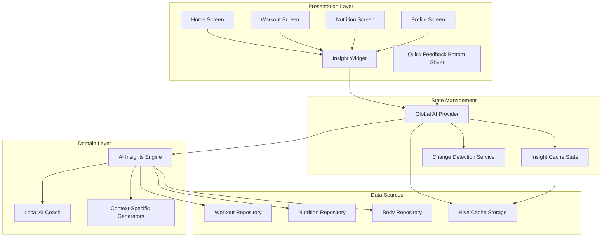
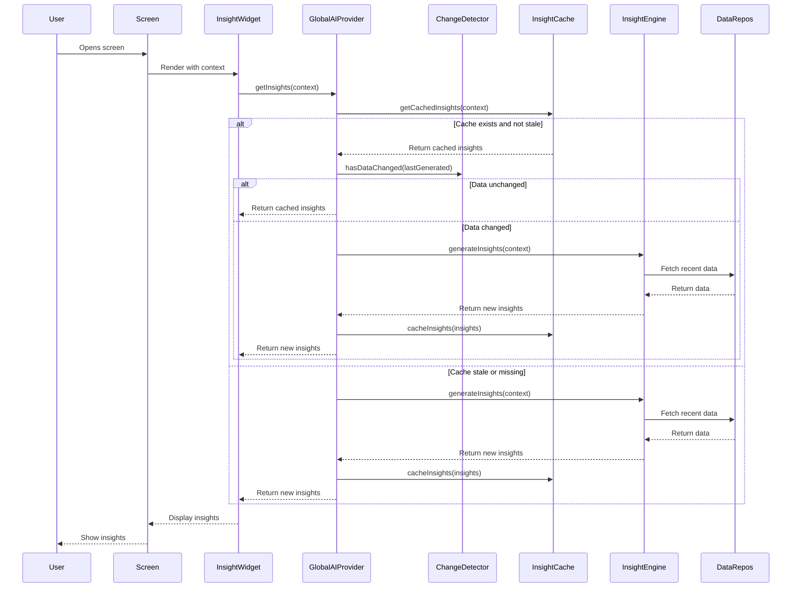

# Design Document: Global AI Coach

## Overview

The Global AI Coach transforms the AI module from a chat-only feature into a comprehensive fitness coaching system that provides data-driven insights across the entire IronFlow app. This design leverages the existing Flutter/Riverpod architecture and extends it with an intelligent insight engine that automatically analyzes user data and surfaces actionable coaching advice on all main screens.

### Key Design Principles

1. **Local-First Processing**: All data analysis happens on-device using the existing LocalAICoach service
2. **Reactive Architecture**: Insights auto-update when underlying data changes using Riverpod's reactive state management
3. **Performance-Optimized**: Multi-layer caching strategy (memory + Hive) with intelligent change detection
4. **Context-Aware**: Different insights for different screens (Home, Workout, Nutrition, Profile)
5. **Reusable Components**: Single InsightWidget component used across all screens
6. **Non-Blocking**: Asynchronous insight generation that never blocks the UI thread

### Architecture Diagram



## Architecture

### System Components

#### 1. Global AI Provider (`GlobalAIProvider`)
- **Responsibility**: Centralized state management for all AI insights
- **Location**: `lib/features/ai/presentation/providers/global_ai_provider.dart`
- **Key Features**:
  - Maintains insight state for each context (Home, Workout, Nutrition, Profile)
  - Listens to data change events from workout, nutrition, and body providers
  - Implements batching logic to prevent excessive regeneration
  - Manages cache invalidation and refresh logic

#### 2. AI Insights Engine (`AIInsightsEngine`)
- **Responsibility**: Core logic for generating context-specific insights
- **Location**: `lib/features/ai/domain/services/ai_insights_engine.dart`
- **Key Features**:
  - Analyzes workout data (volume, progressive overload, PRs, muscle balance)
  - Analyzes nutrition data (macro adherence, protein intake, calorie tracking)
  - Analyzes body metrics (weight trends, goal alignment)
  - Generates 2-3 prioritized insights per context
  - Formats insights with specific numbers and actionable recommendations

#### 3. Insight Cache Service (`InsightCacheService`)
- **Responsibility**: Persistent storage and retrieval of generated insights
- **Location**: `lib/features/ai/data/services/insight_cache_service.dart`
- **Key Features**:
  - Uses Hive for local storage
  - Stores insights with timestamps and context metadata
  - Implements TTL (Time To Live) logic for cache expiration
  - Provides cache invalidation methods

#### 4. Change Detection Service (`ChangeDetectionService`)
- **Responsibility**: Determines if data has changed since last insight generation
- **Location**: `lib/features/ai/domain/services/change_detection_service.dart`
- **Key Features**:
  - Tracks last update timestamps for each data source
  - Compares current data timestamps with cached insight timestamps
  - Returns boolean indicating if regeneration is needed

#### 5. Insight Widget (`InsightWidget`)
- **Responsibility**: Reusable UI component for displaying insights
- **Location**: `lib/features/ai/presentation/widgets/insight_widget.dart`
- **Key Features**:
  - Accepts context parameter to determine which insights to display
  - Shows loading, error, and empty states
  - Implements glassmorphic design with fade/slide animations
  - Tappable to navigate to AI chat screen with pre-populated context

#### 6. Quick Feedback System (`QuickFeedbackBottomSheet`)
- **Responsibility**: Immediate post-workout feedback
- **Location**: `lib/features/ai/presentation/widgets/quick_feedback_bottom_sheet.dart`
- **Key Features**:
  - Automatically appears after workout completion
  - Highlights PRs, volume records, consistency milestones
  - Dismissible by swipe or tap outside
  - Includes CTA to view detailed insights

## Components and Interfaces

### Domain Entities

#### Insight Entity
```dart
@freezed
class Insight with _$Insight {
  const factory Insight({
    required String id,
    required InsightContext context,
    required String title,
    required String message,
    required String icon,
    required InsightPriority priority,
    required DateTime generatedAt,
    Map<String, dynamic>? metadata,
  }) = _Insight;
}

enum InsightContext {
  home,
  workout,
  nutrition,
  profile,
}

enum InsightPriority {
  high,    // Critical actions (e.g., 3+ days without workout)
  medium,  // Important recommendations (e.g., protein deficit)
  low,     // General encouragement and tips
}
```

#### InsightCache Entity
```dart
@freezed
class InsightCache with _$InsightCache {
  const factory InsightCache({
    required InsightContext context,
    required List<Insight> insights,
    required DateTime cachedAt,
    required Map<String, DateTime> dataTimestamps,
  }) = _InsightCache;
}
```

#### InsightGenerationContext
```dart
class InsightGenerationContext {
  final InsightContext context;
  final UserProfile? profile;
  final List<Workout> recentWorkouts;
  final List<DailyNutritionSummary> nutritionHistory;
  final NutritionTargets? nutritionTargets;
  final List<BodyEntry> bodyEntries;
  final DateTime generatedAt;
  
  const InsightGenerationContext({
    required this.context,
    this.profile,
    required this.recentWorkouts,
    required this.nutritionHistory,
    this.nutritionTargets,
    required this.bodyEntries,
    required this.generatedAt,
  });
}
```

### Service Interfaces

#### AIInsightsEngine Interface
```dart
abstract class AIInsightsEngine {
  /// Generate insights for a specific context
  Future<List<Insight>> generateInsights(InsightGenerationContext context);
  
  /// Generate quick feedback after workout completion
  Future<Insight> generateQuickFeedback(Workout completedWorkout, List<Workout> history);
  
  /// Calculate workout volume
  double calculateVolume(Workout workout);
  
  /// Detect progressive overload
  bool detectProgressiveOverload(List<Workout> workouts);
  
  /// Calculate protein deficit
  double calculateProteinDeficit(List<DailyNutritionSummary> nutrition, NutritionTargets targets);
  
  /// Analyze weight trend
  WeightTrend analyzeWeightTrend(List<BodyEntry> entries);
}
```

#### InsightCacheService Interface
```dart
abstract class InsightCacheService {
  /// Initialize Hive box
  Future<void> init();
  
  /// Get cached insights for a context
  Future<InsightCache?> getCachedInsights(InsightContext context);
  
  /// Save insights to cache
  Future<void> cacheInsights(InsightCache cache);
  
  /// Invalidate cache for a context
  Future<void> invalidateCache(InsightContext context);
  
  /// Clear all cached insights
  Future<void> clearAll();
  
  /// Check if cache is stale (older than 1 hour)
  bool isCacheStale(InsightCache cache);
}
```

#### ChangeDetectionService Interface
```dart
abstract class ChangeDetectionService {
  /// Check if workout data has changed since last generation
  Future<bool> hasWorkoutDataChanged(DateTime lastGenerated);
  
  /// Check if nutrition data has changed since last generation
  Future<bool> hasNutritionDataChanged(DateTime lastGenerated);
  
  /// Check if body data has changed since last generation
  Future<bool> hasBodyDataChanged(DateTime lastGenerated);
  
  /// Get timestamp of last data change for a context
  Future<DateTime?> getLastDataChange(InsightContext context);
}
```

### Provider Interfaces

#### GlobalAIProvider State
```dart
@freezed
class GlobalAIState with _$GlobalAIState {
  const factory GlobalAIState({
    @Default({}) Map<InsightContext, List<Insight>> insights,
    @Default({}) Map<InsightContext, DateTime> lastUpdated,
    @Default({}) Map<InsightContext, bool> isLoading,
    @Default({}) Map<InsightContext, String?> errors,
    Insight? quickFeedback,
  }) = _GlobalAIState;
}
```

#### GlobalAIProvider Methods
```dart
class GlobalAINotifier extends StateNotifier<GlobalAIState> {
  /// Get insights for a specific context
  Future<List<Insight>> getInsights(InsightContext context);
  
  /// Manually refresh insights for a context
  Future<void> refreshInsights(InsightContext context);
  
  /// Handle workout completion event
  Future<void> onWorkoutCompleted(Workout workout);
  
  /// Handle meal logged event
  Future<void> onMealLogged(Meal meal);
  
  /// Handle body weight recorded event
  Future<void> onBodyWeightRecorded(BodyEntry entry);
  
  /// Dismiss quick feedback
  void dismissQuickFeedback();
  
  /// Initialize provider (restore cache, set up listeners)
  Future<void> init();
}
```

## Data Models

### Hive Models for Caching

#### InsightCacheModel (Hive Adapter)
```dart
@HiveType(typeId: 10)
class InsightCacheModel extends HiveObject {
  @HiveField(0)
  final String context; // 'home', 'workout', 'nutrition', 'profile'
  
  @HiveField(1)
  final List<InsightModel> insights;
  
  @HiveField(2)
  final DateTime cachedAt;
  
  @HiveField(3)
  final Map<String, int> dataTimestamps; // Stored as milliseconds since epoch
  
  InsightCacheModel({
    required this.context,
    required this.insights,
    required this.cachedAt,
    required this.dataTimestamps,
  });
  
  // Conversion methods to/from domain entity
  InsightCache toDomain() { /* ... */ }
  static InsightCacheModel fromDomain(InsightCache cache) { /* ... */ }
}
```

#### InsightModel (Hive Adapter)
```dart
@HiveType(typeId: 11)
class InsightModel {
  @HiveField(0)
  final String id;
  
  @HiveField(1)
  final String context;
  
  @HiveField(2)
  final String title;
  
  @HiveField(3)
  final String message;
  
  @HiveField(4)
  final String icon;
  
  @HiveField(5)
  final String priority; // 'high', 'medium', 'low'
  
  @HiveField(6)
  final DateTime generatedAt;
  
  @HiveField(7)
  final Map<String, dynamic>? metadata;
  
  InsightModel({
    required this.id,
    required this.context,
    required this.title,
    required this.message,
    required this.icon,
    required this.priority,
    required this.generatedAt,
    this.metadata,
  });
  
  // Conversion methods to/from domain entity
  Insight toDomain() { /* ... */ }
  static InsightModel fromDomain(Insight insight) { /* ... */ }
}
```

### Data Flow Diagram



## Error Handling

### Error Handling Strategy

#### 1. Insight Generation Failures
```dart
try {
  final insights = await _insightEngine.generateInsights(context);
  state = state.copyWith(
    insights: {...state.insights, context: insights},
    errors: {...state.errors, context: null},
  );
} catch (e, stackTrace) {
  // Log error for debugging
  debugPrint('Failed to generate insights for $context: $e');
  debugPrint('Stack trace: $stackTrace');
  
  // Try to return cached insights as fallback
  final cached = await _cacheService.getCachedInsights(context);
  if (cached != null) {
    state = state.copyWith(
      insights: {...state.insights, context: cached.insights},
      errors: {...state.errors, context: null},
    );
  } else {
    // Set error state
    state = state.copyWith(
      errors: {...state.errors, context: 'Failed to generate insights'},
    );
  }
}
```

#### 2. Cache Read/Write Failures
```dart
try {
  await _cacheService.cacheInsights(cache);
} catch (e) {
  // Log but don't fail - caching is optional
  debugPrint('Failed to cache insights: $e');
  // Continue without caching
}
```

#### 3. Data Fetch Failures
```dart
try {
  final workouts = await _workoutRepo.getWorkoutsByDateRange(start, end);
} catch (e) {
  // Use empty list as fallback
  final workouts = <Workout>[];
  debugPrint('Failed to fetch workouts: $e');
}
```

#### 4. Timeout Handling
```dart
final insights = await _insightEngine
    .generateInsights(context)
    .timeout(
      const Duration(seconds: 5),
      onTimeout: () async {
        // Return cached insights if available
        final cached = await _cacheService.getCachedInsights(context);
        if (cached != null) {
          return cached.insights;
        }
        // Return generic motivational insights
        return _generateFallbackInsights(context);
      },
    );
```

### Error States in UI

#### InsightWidget Error Handling
```dart
Widget build(BuildContext context) {
  final insightsAsync = ref.watch(globalAIProvider.select(
    (state) => state.insights[widget.context],
  ));
  final error = ref.watch(globalAIProvider.select(
    (state) => state.errors[widget.context],
  ));
  
  if (error != null) {
    return _buildErrorState(error);
  }
  
  if (insightsAsync == null || insightsAsync.isEmpty) {
    return _buildEmptyState();
  }
  
  return _buildInsightsList(insightsAsync);
}

Widget _buildErrorState(String error) {
  return GlassmorphicCard(
    child: Column(
      children: [
        Icon(Icons.error_outline, color: Colors.orange),
        Text('Unable to generate insights'),
        ElevatedButton(
          onPressed: () => ref.read(globalAIProvider.notifier)
              .refreshInsights(widget.context),
          child: Text('Retry'),
        ),
      ],
    ),
  );
}

Widget _buildEmptyState() {
  return GlassmorphicCard(
    child: Column(
      children: [
        Icon(Icons.lightbulb_outline),
        Text('Start logging data to get personalized insights!'),
      ],
    ),
  );
}
```

## Testing Strategy

### Unit Tests

#### 1. AIInsightsEngine Tests
- Test volume calculation with various workout structures
- Test progressive overload detection with increasing/decreasing volume
- Test protein deficit calculation with different targets
- Test weight trend analysis with various patterns
- Test insight prioritization logic
- Test edge cases (empty data, single data point, extreme values)

#### 2. ChangeDetectionService Tests
- Test change detection with modified data
- Test change detection with unchanged data
- Test timestamp comparison logic
- Test handling of missing timestamps

#### 3. InsightCacheService Tests
- Test cache save and retrieve operations
- Test cache invalidation
- Test stale cache detection
- Test cache expiration (TTL)
- Test Hive adapter serialization/deserialization

#### 4. GlobalAIProvider Tests
- Test insight retrieval with cache hit
- Test insight retrieval with cache miss
- Test batching logic (multiple changes within 5 seconds)
- Test event listeners (workout completion, meal logged, body weight recorded)
- Test error handling and fallback logic

### Integration Tests

#### 1. End-to-End Insight Generation
- Test complete flow from data change to insight display
- Test cache persistence across app restarts
- Test insight refresh on manual trigger
- Test quick feedback display after workout completion

#### 2. Screen Integration Tests
- Test InsightWidget rendering on Home screen
- Test InsightWidget rendering on Workout screen
- Test InsightWidget rendering on Nutrition screen
- Test InsightWidget rendering on Profile screen
- Test navigation to AI chat from InsightWidget

### Widget Tests

#### 1. InsightWidget Tests
- Test loading state display
- Test error state display with retry button
- Test empty state display
- Test insights list display
- Test tap navigation to AI chat
- Test animation behavior

#### 2. QuickFeedbackBottomSheet Tests
- Test display of PR achievements
- Test display of volume records
- Test display of consistency milestones
- Test dismiss behavior (swipe down, tap outside)
- Test CTA button navigation

### Performance Tests

#### 1. Insight Generation Performance
- Measure insight generation time for each context
- Verify generation completes within 500ms
- Test with large datasets (100+ workouts, 30+ days nutrition)

#### 2. Cache Performance
- Measure cache read/write times
- Verify cache retrieval is faster than generation
- Test cache size limits

#### 3. Change Detection Performance
- Measure change detection time
- Verify detection completes within 100ms
- Test with large datasets

### Test Coverage Goals
- Unit test coverage: 80%+
- Integration test coverage: 60%+
- Widget test coverage: 70%+
- Critical paths (insight generation, caching, change detection): 90%+

## Implementation Plan

### Phase 1: Foundation (Domain Layer)
1. Create domain entities (Insight, InsightCache, InsightGenerationContext)
2. Define service interfaces (AIInsightsEngine, InsightCacheService, ChangeDetectionService)
3. Implement AIInsightsEngine with core analysis logic
4. Write unit tests for AIInsightsEngine

### Phase 2: Data Layer
1. Create Hive models (InsightCacheModel, InsightModel)
2. Generate Hive adapters
3. Implement InsightCacheService with Hive storage
4. Implement ChangeDetectionService
5. Write unit tests for cache and change detection

### Phase 3: State Management
1. Create GlobalAIState and GlobalAINotifier
2. Implement insight retrieval with caching logic
3. Implement event listeners for data changes
4. Implement batching logic
5. Write unit tests for GlobalAIProvider

### Phase 4: UI Components
1. Create InsightWidget with loading/error/empty states
2. Implement glassmorphic design and animations
3. Create QuickFeedbackBottomSheet
4. Write widget tests

### Phase 5: Screen Integration
1. Integrate InsightWidget into Home screen
2. Integrate InsightWidget into Workout screen
3. Integrate InsightWidget into Nutrition screen
4. Integrate InsightWidget into Profile screen
5. Implement quick feedback trigger on workout completion
6. Write integration tests

### Phase 6: Polish and Optimization
1. Performance profiling and optimization
2. Error handling refinement
3. Cache tuning (TTL, size limits)
4. UI polish and animations
5. Documentation

## Dependencies

### New Dependencies
- None required (uses existing dependencies)

### Existing Dependencies Used
- `flutter_riverpod`: State management
- `freezed`: Immutable data classes
- `hive`: Local storage for cache
- `uuid`: Generating unique IDs for insights

### Internal Dependencies
- `features/workout`: Workout data and providers
- `features/nutrition`: Nutrition data and providers
- `features/body`: Body metrics data and providers
- `features/auth`: User profile data
- `features/ai`: Existing LocalAICoach service

## Performance Considerations

### Caching Strategy

#### Three-Layer Caching
1. **Memory Cache**: In-memory state in GlobalAIProvider (fastest)
2. **Hive Cache**: Persistent local storage (fast, survives app restarts)
3. **Generation**: Fresh insight generation (slowest, only when needed)

#### Cache Invalidation Rules
- **Time-based**: Cache expires after 1 hour
- **Data-based**: Cache invalidates when underlying data changes
- **Manual**: User can manually refresh insights

### Change Detection Optimization

#### Timestamp Tracking
```dart
class ChangeDetectionService {
  // Track last known timestamps for each data source
  final Map<String, DateTime> _lastKnownTimestamps = {};
  
  Future<bool> hasWorkoutDataChanged(DateTime lastGenerated) async {
    final latestWorkout = await _workoutRepo.getLatestWorkout();
    if (latestWorkout == null) return false;
    
    final lastKnown = _lastKnownTimestamps['workout'];
    if (lastKnown == null || latestWorkout.date.isAfter(lastKnown)) {
      _lastKnownTimestamps['workout'] = latestWorkout.date;
      return true;
    }
    return false;
  }
}
```

### Batching Logic

#### Debouncing Multiple Changes
```dart
class GlobalAINotifier extends StateNotifier<GlobalAIState> {
  Timer? _batchTimer;
  final Set<InsightContext> _pendingRefresh = {};
  
  void _scheduleRefresh(InsightContext context) {
    _pendingRefresh.add(context);
    
    // Cancel existing timer
    _batchTimer?.cancel();
    
    // Start new timer - refresh after 5 seconds of no new changes
    _batchTimer = Timer(const Duration(seconds: 5), () async {
      final contexts = Set<InsightContext>.from(_pendingRefresh);
      _pendingRefresh.clear();
      
      // Refresh all pending contexts in parallel
      await Future.wait(
        contexts.map((ctx) => _refreshInsightsInternal(ctx)),
      );
    });
  }
}
```

### Query Optimization

#### Date Range Limiting
```dart
class AIInsightsEngine {
  Future<List<Insight>> generateInsights(InsightGenerationContext context) async {
    // Only fetch data for required date ranges
    final thirtyDaysAgo = DateTime.now().subtract(const Duration(days: 30));
    final sevenDaysAgo = DateTime.now().subtract(const Duration(days: 7));
    
    // Parallel data fetching
    final results = await Future.wait([
      _workoutRepo.getWorkoutsByDateRange(thirtyDaysAgo, DateTime.now()),
      _nutritionRepo.getNutritionHistory(sevenDaysAgo, DateTime.now()),
      _bodyRepo.getBodyEntriesByDateRange(thirtyDaysAgo, DateTime.now()),
    ]);
    
    final workouts = results[0] as List<Workout>;
    final nutrition = results[1] as List<DailyNutritionSummary>;
    final bodyEntries = results[2] as List<BodyEntry>;
    
    // Generate insights...
  }
}
```

### Async Processing

#### Non-Blocking Generation
```dart
class GlobalAINotifier extends StateNotifier<GlobalAIState> {
  Future<List<Insight>> getInsights(InsightContext context) async {
    // Set loading state immediately
    state = state.copyWith(
      isLoading: {...state.isLoading, context: true},
    );
    
    // Generate insights asynchronously
    final insights = await compute(_generateInsightsIsolate, context);
    
    // Update state
    state = state.copyWith(
      insights: {...state.insights, context: insights},
      isLoading: {...state.isLoading, context: false},
    );
    
    return insights;
  }
}

// Run in separate isolate for heavy computation
Future<List<Insight>> _generateInsightsIsolate(InsightContext context) async {
  // Heavy computation here
}
```

## Security and Privacy

### Data Privacy Principles
1. **Local Processing**: All data analysis happens on-device
2. **No External Transmission**: User data never leaves the device
3. **User Control**: Users can clear cached insights at any time
4. **Transparent Storage**: Cache stored in standard Hive location

### Data Deletion
```dart
class GlobalAINotifier extends StateNotifier<GlobalAIState> {
  /// Clear all cached insights (called when user deletes data)
  Future<void> clearAllInsights() async {
    await _cacheService.clearAll();
    state = const GlobalAIState();
  }
  
  /// Invalidate insights related to deleted data
  Future<void> onDataDeleted(String dataType) async {
    switch (dataType) {
      case 'workout':
        await _cacheService.invalidateCache(InsightContext.home);
        await _cacheService.invalidateCache(InsightContext.workout);
        break;
      case 'nutrition':
        await _cacheService.invalidateCache(InsightContext.home);
        await _cacheService.invalidateCache(InsightContext.nutrition);
        break;
      case 'body':
        await _cacheService.invalidateCache(InsightContext.home);
        await _cacheService.invalidateCache(InsightContext.profile);
        break;
    }
  }
}
```

## Migration Strategy

### Backward Compatibility
- Existing AI chat functionality remains unchanged
- New insight features are additive, not breaking
- Existing LocalAICoach service is reused and extended

### Gradual Rollout
1. **Phase 1**: Deploy insight engine and caching (no UI changes)
2. **Phase 2**: Add InsightWidget to Home screen only
3. **Phase 3**: Add InsightWidget to remaining screens
4. **Phase 4**: Add quick feedback system

### Feature Flags
```dart
class FeatureFlags {
  static const bool enableGlobalAICoach = true;
  static const bool enableQuickFeedback = true;
  static const bool enableInsightCaching = true;
}
```

## Future Enhancements

### Potential Improvements
1. **Machine Learning**: Replace rule-based logic with ML models for better insights
2. **Personalization**: Learn user preferences and adjust insight style
3. **Goal Tracking**: Integrate with user-defined goals for targeted insights
4. **Social Features**: Compare insights with friends (opt-in)
5. **Voice Insights**: Audio playback of insights for hands-free use
6. **Wearable Integration**: Incorporate data from fitness trackers
7. **Advanced Analytics**: More sophisticated trend analysis and predictions
8. **Customizable Insights**: Let users choose which insights to prioritize

### Scalability Considerations
- Current design supports up to 1000 workouts, 365 days nutrition, 365 body entries
- For larger datasets, implement pagination and windowing
- Consider background processing for very large datasets
- Monitor cache size and implement LRU eviction if needed

---

## Appendix

### Glossary
- **Insight**: A single piece of coaching advice with title, message, and metadata
- **Context**: The screen or domain for which insights are generated (Home, Workout, Nutrition, Profile)
- **Cache**: Stored insights that can be reused without regeneration
- **Change Detection**: Process of determining if data has changed since last insight generation
- **Batching**: Combining multiple data changes into a single insight regeneration
- **TTL**: Time To Live - how long cached insights remain valid
- **Progressive Overload**: Training principle of gradually increasing volume or intensity
- **Volume**: Total weight lifted (reps × weight) across all sets
- **PR**: Personal Record - maximum weight lifted for a specific exercise

### References
- Flutter Riverpod Documentation: https://riverpod.dev
- Hive Documentation: https://docs.hivedb.dev
- Freezed Documentation: https://pub.dev/packages/freezed
- IronFlow Architecture: See existing codebase structure
